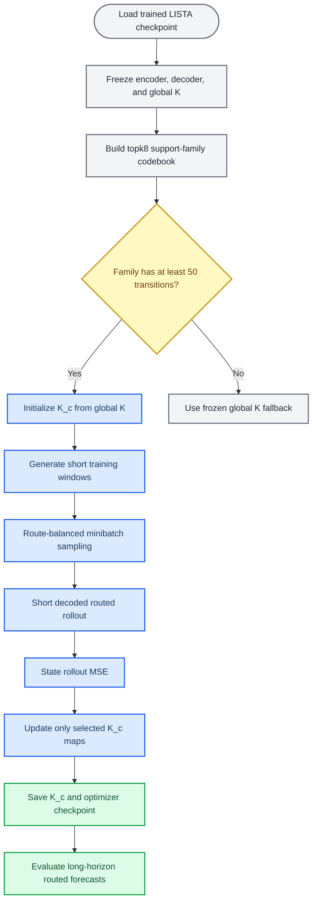

# Support-Family Local \(K_c\) Training Protocol

_Protocol note for the May 2026 routed forecasting experiments._

---

## Summary

Yes: in the current stage-2 local-map setup, the training loss is only decoded
state rollout MSE. The existing LISTA checkpoint is loaded, and the encoder,
decoder, and original global Koopman map \(K\) are frozen. The only learned
parameters are the retained support-family local maps \(K_c\).

The frozen encoder and decoder are still used inside the computation graph:
the encoder maps initial states and periodic re-encoded predictions into latent
space, and the decoder maps predicted latents back to state space. Their
weights do not update. Route selection is non-differentiable: the current
latent is detached, converted to a support mask, assigned to a support family,
and used to select either a trainable \(K_c\) or the frozen global \(K\).

## Objects

| Object | Role | Trainable? |
|---|---|---:|
| Encoder \(\mathrm{Enc}\) | Maps states \(x\) to latent codes \(z\) | No |
| Decoder \(\mathrm{Dec}\) | Maps latent codes \(z\) back to states \(x\) | No |
| Global \(K\) | Original checkpoint Koopman map and fallback map | No |
| Support-family centers \(\bar z_c\) | Mean latent for each retained route family | No |
| Local maps \(K_c\) | Centered support-family transition maps | Yes |

Each retained local map is initialized from the original global map:

\[
K_c \leftarrow K.
\]

For a routed latent \(z_t\), the local transition rule is centered at the
family representative vector:

\[
\hat z_{t+1} = \bar z_c + K_c(\hat z_t - \bar z_c).
\]

If the current support family is not retained because it has fewer than `50`
fitting transitions, the transition falls back to the frozen global map:

\[
\hat z_{t+1} = K \hat z_t.
\]

## Route construction

Routes are built without basin labels, attractor labels, or known basin counts.

1. Generate fitting trajectories for the system and seed.
2. Encode them with the frozen checkpoint encoder.
3. Compute `topk:8` support masks from the encoded latents.
4. Merge exact supports into support families with greedy Jaccard threshold
   `0.40`.
5. Count current-state fitting transitions per family.
6. Retain only families with at least `50` fitting transitions.
7. Compute \(\bar z_c\) as the mean current-state latent for each retained
   family.
8. Build a route codebook from exact supports and family prototypes.

The support-family center is therefore not a learned parameter. It is a fixed
representative latent vector calculated from fitting trajectories before
stage-2 optimization begins.

## Training data and sampling

Each worker trains one `(benchmark, system, seed)` shard. It generates a pool
of short training windows from the same dynamical system:

- Controlled multibasin windows use the source checkpoint's short horizon,
  currently `8`.
- Dysts windows use the source checkpoint's short horizon, currently `10`.

The training pool is bucketed by the initial route of \(\mathrm{Enc}(x_0)\).
Minibatches are route-balanced: each optimizer step samples route buckets
approximately uniformly, then samples windows from the selected buckets. This
keeps large support families from dominating the updates.

All retained \(K_c\) maps for the shard are trained jointly in one
`LocalMapBundle`. There is one optimizer over the whole bank of maps, not one
separate optimizer or SLURM job per family. A given map receives gradients only
on examples and rollout steps where it is selected.

## Rollout and re-encoding

The selected 50k/100k setup uses:

- `reencode_period=5`
- `route_freeze_mode=reroute_each_step`

This means the route is recomputed before every one-step local-map application.
Every fifth predicted step, the decoded prediction is passed back through the
frozen encoder before continuing:

\[
\hat z \leftarrow \mathrm{Enc}(\mathrm{Dec}(\hat z)).
\]

This periodic decode/re-encode operation is meant to bring the forecast back
onto the encoder manifold and let subsequent route decisions use the support
family of the re-encoded predicted state. Because the selected mode is
`reroute_each_step`, route switching can happen at every step; re-encoding
changes the latent representation from which later routes are selected.

The ablation `freeze_within_segment` is different. In that mode, a route is
selected at the start of a re-encoding segment and reused until the next
segment boundary. The active 50k/100k runs are not using that ablation.

## Objective and gradients

For a training window \((x_0,\ldots,x_H)\), the model predicts
\((\hat x_1,\ldots,\hat x_H)\) and minimizes:

\[
\mathcal L =
\frac{1}{BH}\sum_{b=1}^{B}\sum_{t=1}^{H}
\|\hat x_{b,t} - x_{b,t}\|_2^2.
\]

There is no additional term in this experiment:

- No latent MSE
- No support classification loss
- No basin-label loss
- No route entropy or balance loss
- No spectral penalty
- No residual-local-map regularizer
- No validation-gating objective

The encoder and decoder are frozen, but gradients can still pass through their
operations to the selected \(K_c\) maps when the operation is part of the
rollout graph. The initial encoding of \(x_0\) is run under `no_grad`; periodic
re-encoding of predicted states is frozen-weight but differentiable with
respect to its input. Route assignment itself is detached and non-differentiable.

## Calibrated global \(K\) ablation

The calibrated-global ablation uses the same stage-2 machinery but changes the
trainable parameterization:

| Component | Local \(K_c\) run | Calibrated-global ablation |
|---|---|---|
| Trainable maps | One \(K_c\) per retained support family | One dense \(K_{\mathrm{cal}}\) |
| Initialization | \(K_c \leftarrow K\) for every family | \(K_{\mathrm{cal}} \leftarrow K\) |
| Routing | Selects which \(K_c\) applies | Used only to balance minibatches |
| Latent update | \(\bar z_c + K_c(z-\bar z_c)\) | \(K_{\mathrm{cal}}z\) |
| Frozen weights | Encoder, decoder, original \(K\) fallback | Encoder and decoder |
| Loss | Decoded rollout MSE | Decoded rollout MSE |

This is a fairness ablation for second-stage calibration. It asks whether the
extra rollout-MSE training data and periodic re-encoding are sufficient on
their own, before attributing any improvement to support-family-local maps.
The same route codebook is still built so minibatches are sampled uniformly
over support-family buckets, but the selected route does not choose the
transition matrix.

## Workflow diagram



## Pseudocode

```python
def train_support_family_local_maps(checkpoint, system, seed):
    model = load_checkpoint(checkpoint, system)
    model.eval()
    freeze_all_model_parameters(model)

    encoder = model.encoder
    decoder = model.decoder
    K_global = model.kmatrix()
    train_horizon = checkpoint_sequence_length(checkpoint)  # 8 or 10

    # Build label-free route codebook.
    fit_x = generate_observation_trajectories(
        system,
        num_trajectories=fit_num_trajectories,
        trajectory_length=fit_trajectory_length,
        eval_seed=fit_eval_seed,
    )
    fit_z = encode_trajectories(encoder, fit_x)
    support_masks = topk_support(fit_z, k=8)
    family_labels = greedy_jaccard_families(
        support_masks,
        min_jaccard=0.40,
    )

    fitted_families = []
    centers = {}
    for family in unique(family_labels.current_state_labels()):
        assigned = current_state_latents(fit_z, family_labels == family)
        if len(assigned) >= 50:
            fitted_families.append(family)
            centers[family] = mean(assigned, axis=0)

    # One trainable bank of local maps for the shard.
    K_local = {}
    for family in fitted_families:
        K_local[family] = trainable_parameter(copy(K_global))

    optimizer = AdamW(parameters=K_local.values(), lr=1e-3, weight_decay=0.0)

    # Route-balanced training pool.
    train_x = generate_observation_trajectories(
        system,
        num_trajectories=train_pool_trajectories,
        trajectory_length=train_horizon + 1,
        eval_seed=train_pool_seed + seed,
    )
    with no_grad():
        initial_z = encoder(train_x[:, 0])
    initial_routes = route_family(
        initial_z,
        support_rule="topk:8",
        family_codebook=family_labels,
        retained_families=fitted_families,
    )
    route_buckets = group_window_indices_by_route(initial_routes)

    for step in range(start_step_from_checkpoint, train_steps):
        batch_indices = sample_routes_uniformly_then_windows(route_buckets)
        x_seq = train_x[batch_indices]
        x_true = x_seq[:, 1:]

        # Initial encoding is frozen and treated as the rollout start.
        with no_grad():
            z = encoder(x_seq[:, 0])

        x_preds = []
        route = None
        for offset in range(train_horizon):
            # Active setting: reroute before every one-step update.
            route = route_family(
                detach(z),
                support_rule="topk:8",
                family_codebook=family_labels,
                retained_families=fitted_families,
            )

            if route is retained:
                c = centers[route]
                z_next = c + apply_linear_map(K_local[route], z - c)
            else:
                z_next = apply_linear_map(K_global, z)

            x_pred = decoder(z_next)
            x_preds.append(x_pred)

            if (offset + 1) % 5 == 0:
                # Encoder weights are frozen, but this operation can still
                # pass gradients from later losses back to K_local.
                z = encoder(x_pred)
            else:
                z = z_next

        loss = mean_squared_error(stack(x_preds, dim=1), x_true)
        optimizer.zero_grad()
        loss.backward()
        optimizer.step()

        periodically_save_checkpoint(K_local, optimizer, step + 1)

    return K_local
```

```python
def train_calibrated_global_map(checkpoint, system, seed):
    model = load_checkpoint(checkpoint, system)
    model.eval()
    freeze_all_model_parameters(model)

    encoder = model.encoder
    decoder = model.decoder
    K_calibrated = trainable_parameter(copy(model.kmatrix()))
    optimizer = AdamW(parameters=[K_calibrated], lr=1e-3, weight_decay=0.0)

    # Build the same support-family codebook as the local K_c run, but use it
    # only to construct balanced route buckets.
    family_codebook = build_topk8_jaccard040_codebook(
        encoder=encoder,
        system=system,
        fit_num_trajectories=fit_num_trajectories,
        fit_trajectory_length=fit_trajectory_length,
    )
    train_x = generate_observation_trajectories(
        system,
        num_trajectories=train_pool_trajectories,
        trajectory_length=train_horizon + 1,
        eval_seed=train_pool_seed + seed,
    )
    with no_grad():
        initial_z = encoder(train_x[:, 0])
    route_buckets = group_window_indices_by_route(
        route_family(initial_z, family_codebook=family_codebook)
    )

    for step in range(start_step_from_checkpoint, train_steps):
        batch_indices = sample_routes_uniformly_then_windows(route_buckets)
        x_seq = train_x[batch_indices]
        x_true = x_seq[:, 1:]

        with no_grad():
            z = encoder(x_seq[:, 0])

        x_preds = []
        for offset in range(train_horizon):
            z_next = apply_linear_map(K_calibrated, z)
            x_pred = decoder(z_next)
            x_preds.append(x_pred)

            if (offset + 1) % 5 == 0:
                z = encoder(x_pred)
            else:
                z = z_next

        loss = mean_squared_error(stack(x_preds, dim=1), x_true)
        optimizer.zero_grad()
        loss.backward()
        optimizer.step()

        periodically_save_checkpoint(K_calibrated, optimizer, step + 1)

    return K_calibrated
```

## 50k to 100k continuation

The `50000`-step jobs save `train_checkpoint.pt` with the local maps,
optimizer state, RNG state, and next step. The `100000`-step continuation jobs
load the matching 50k checkpoint and continue from `next_step=50000` to
`train_steps=100000`. They do not restart from global \(K\) unless the resume
checkpoint is missing, which would indicate a misconfigured shard.
