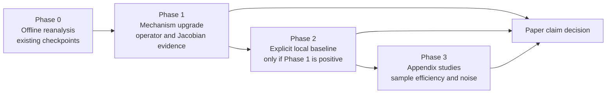

# Review-Response Experiment Plan

Date: April 18, 2026

## Purpose

This document translates the pre-publication review into a concrete experiment
plan for the current paper. The goal is to decide, with as little unnecessary
new training as possible, whether the paper can support a strong mechanism
claim, a weaker but still publishable mechanism claim, or only a forecasting /
representation claim.

The central scientific question is:

\[
\text{basin}
\;\rightarrow\;
\text{support family}
\;\rightarrow\;
\text{local linear law}.
\]

The strongest version of the paper would show one exact support per basin and a
distinct support-selected local operator. The more realistic target, given the
current evidence, is:

\[
\text{basin}
\;\rightarrow\;
\text{support family / dominant group / aligned support class}
\;\rightarrow\;
\text{local operator family up to simple alignment}.
\]

This plan therefore prioritizes experiments that answer the mechanism question
directly, not just additional forecasting tables.

## Current Claim Boundary

The current docs already support three points:

1. Some induced sparsity matters relative to matched non-sparse controls.
2. Basin-support alignment exists on part of the fixed `17`-system shortlist,
   especially on deep-basin slices and especially at the support-family or
   dominant-group level.
3. Exact-support uniqueness is not yet established, and the current fixed-`17`
   evidence does not yet justify the claim that exact supports select the local
   linear law.

The review is therefore directionally correct on the main gap: the paper needs
direct evidence that support or support family selects a local linearization,
not merely that support correlates with basin or that the model forecasts well.

## Decision Framework

We should evaluate the paper against three claim tiers.

| Claim tier | What must be shown | Paper outcome |
| --- | --- | --- |
| Strong | One exact support per basin, support-conditioned operators match basin-conditioned operators, and switch timing aligns with controlled transfer | Strong main-text mechanism claim |
| Moderate | One support family / dominant group / aligned support class per basin, and those classes select local operator families or Jacobian families | Publishable mechanism claim and likely best realistic target |
| Weak | Supports improve basin separation or forecasting but do not select local operator families | Reposition paper around induced sparsity and basin separation, not local-law interpretability |

## High-Level Execution Strategy

The plan should proceed in four phases.

The key design principle is:

- Prefer offline evaluation on existing checkpoints whenever possible.
- Add code before adding new training.
- Add one explicit local baseline only after the support-family mechanism read
  is itself strong enough to be worth comparing against a local model.

## Review-Point Triage

The table below maps the review into concrete work packages.

| Review point | Paper-critical | Can use existing checkpoints | Can use existing code directly | Needs code extension | Needs new training |
| --- | --- | --- | --- | --- | --- |
| Matched sparse vs non-sparse baseline | Already mostly addressed | Yes | Yes | Minor table cleanup only | No |
| Direct basin-support alignment metrics | Already mostly addressed | Yes | Yes | Minor threshold/seed extension | No |
| Support selects local linearizations | Yes | Yes | Partly | Yes | No, for first pass |
| Comparison to true local geometry | Yes on `2D` toys | Yes | Partly | Yes | No |
| Temporal persistence and switch timing | Yes | Yes | Yes | Minor batching / visualization work | No |
| Causal support interventions | Yes | Yes | Yes | Extend from exact supports to family / dominant-group interventions | No |
| Threshold, seed, relabeling robustness | Yes | Yes | Partly | Yes | No |
| Random partition controls | Yes | Yes | No | Yes | No |
| Explicit local or switching baseline | Important but second-order | No | No | Yes | Yes |
| Sample efficiency / noisy data | Useful but not central | No | No | Yes | Yes |

## Phase 0: Complete The Best Offline Reanalysis First

These items are paper-critical and should be done before any new model
training.

### 0.1 Complete the matched hard-init control interpretability reduction

This is already the main fairness blocker in the docs.

Question:
- Under matched hard-init sampling, does structured sparsity improve
  basin-support alignment or intervention robustness relative to the sparse MLP
  control?

Reuse:
- Existing checkpoints from the matched hard-init MLP packet.
- Existing reducer:
  [tools/reduce_transition_rich_interpretability_metrics.py](/home/mila/l/lia/skae/tools/reduce_transition_rich_interpretability_metrics.py).

Work needed:
- Shard or otherwise split the reducer so the timed-out hard-init control pass
  completes on the existing runs.

Outputs:
- Final hard-init architecture table for `H(B|S)`, `H(S|B)`, `U_exact`,
  support-family metrics, own-support projection, wrong-support projection,
  freeze-support horizons, persistence, and switch metrics.

Why it matters:
- Without this, the main architecture comparison is still partly mixed with the
  sampling regime.

### 0.2 Run the missing deep-versus-boundary forecasting read

Question:
- Are forecasting gains strongest deep inside a basin and weakest near the
  separatrix, as the basin-identity hypothesis predicts?

Reuse:
- Existing fixed `17` checkpoints.
- Existing state splits already used by the reducer.

Work needed:
- Add or expose a horizon-conditioned evaluation pass that reports
  `H100/H500/H1000` by subset: `deep`, `boundary`, and optionally `all`.

Outputs:
- One comparison table and one plot of forecasting error vs horizon, stratified
  by region.

Why it matters:
- This addresses a major reviewer request and closes the missing half of the
  current deep-vs-boundary narrative.

### 0.3 Generate the paper visual suite from existing checkpoints

The reducer already supports the core visual artifacts.

Reuse:
- Existing fixed `17` checkpoints.
- Existing reducer visual options.

Outputs:
1. True basin phase portrait.
2. Dominant support-family phase portrait.
3. Support entropy map.
4. Basin/support confusion heatmap.
5. Support-switch raster for transfer trajectories.
6. Operator-distance heatmap.

Why it matters:
- The review is right that the paper needs to be visually legible on the
  basin-support question.

## Phase 1: Directly Test Whether Support Selects Local Linearizations

This is the core of the plan.

### 1.1 Basin-conditioned vs support-conditioned vs family-conditioned local operators

This is the single most important new experiment.

Question:
- Does conditioning on support or support family recover the same local linear
  structure as conditioning on the true basin?

Experimental unit:
- State transitions on the locked fixed `17` checkpoints.

Subsets:
- `deep`
- `boundary`
- `all`

Partitions to compare:
1. One global partition.
2. True basin partition.
3. Exact support partition.
4. Support-family partition.
5. Dominant-group partition for structured models.

Fits to compute:
- Global latent operator `A_global`.
- Basin-conditioned latent operators `A_b`.
- Support-conditioned latent operators `A_s`.
- Family-conditioned latent operators `A_f`.
- Group-conditioned latent operators `A_g`.

Metrics:
- Within-partition one-step latent prediction error.
- Held-out within-partition one-step latent prediction error.
- Frobenius distances among fitted operators.
- Between-basin over within-basin operator-distance ratio.
- Distance from support-conditioned operators to the corresponding
  basin-conditioned operator.

Required controls:
1. Equal-size random partitions.
2. Size-matched random partitions stratified by subset.
3. Label-shuffled partition assignments within each subset.

Success criterion:
- Support-family or dominant-group operators should beat random partitions and
  approach basin-conditioned operators, at least on the deep slice.

Failure criterion:
- If support-family operators are no better than random partitions, the paper
  cannot claim that support selects the local law.

Reuse:
- Existing reducer already computes raw operator-family summaries and
  support-family labels.

Needed extension:
- Add basin-conditioned operator fits.
- Add explicit equal-size random partition controls.
- Add held-out error reporting for fitted local operators.

Recommended implementation:
- Extend
  [tools/reduce_transition_rich_interpretability_metrics.py](/home/mila/l/lia/skae/tools/reduce_transition_rich_interpretability_metrics.py)
  rather than creating a parallel pipeline.

### 1.2 Compare masked global operators to post-hoc fitted local operators

This is the most direct test of whether the learned global `K` is actually
being used as an implicit support-selected local operator family.

Question:
- For a support or support family `c`, is the projected global operator
  `P_c K P_c` close to the post-hoc fitted local operator `A_c`?

Metrics:
- `||A_c - P_c K P_c||_F`
- Prediction error of `P_c K P_c` vs `A_c`
- Basin-wise averages on `deep` and `boundary` subsets

Why it matters:
- A model may show basin-support alignment while still not using support to
  select the effective local linearization.

Reuse:
- Existing model checkpoints expose `K`.
- Existing support masks and support-family labels already exist in the
  reducer.

Needed extension:
- Add a utility that builds projected operators from the learned `K` and
  compares them with fitted `A_s`, `A_f`, and `A_g`.

Success criterion:
- On the deep slice, support-family or dominant-group projected operators
  should be much closer to fitted local operators than random projected masks
  are.

### 1.3 Upgrade operator comparison to alignment-aware geometry

The current raw operator distances are not enough for the paper.

Question:
- Are operator differences genuinely dynamical, or are they mostly latent
  relabeling, sign, rotation, or reflection effects?

Add these distances:
1. Raw Frobenius distance.
2. Best signed-permutation-aligned distance.
3. Best orthogonal-aligned distance.

Add these summaries:
- Eigenvalue distance.
- Leading eigendirection angle in `2D`.
- Principal angles between invariant subspaces where needed.

Why it matters:
- This is necessary for any honest “operator family” claim in symmetric or
  near-symmetric systems.

Reuse:
- Current reducer already computes raw operator and Jacobian summaries.

Needed extension:
- Add alignment solvers and aligned distance summaries.

Success criterion:
- If raw distances are large but alignment-aware distances are small, we should
  present the result as operator-family reuse up to alignment, not as distinct
  local laws.

### 1.4 Effective state-space Jacobian study on the mechanistic `2D` toys

This is the strongest state-space version of the mechanism claim.

Primary systems:
- `gated_local_linear`
- `gated_transfer_linear`
- one symmetric `4`-basin system
- one asymmetric multi-basin system
- one difficult boundary-geometry system

Question:
- Do states with the same support family or dominant group have similar
  effective Jacobians?
- Do those Jacobians match true basin-conditioned Jacobians near attractors?

Metrics:
- Jacobian between-over-within ratio for support families.
- Distance from support-family Jacobian means to basin-conditioned Jacobian
  means.
- Distance from learned Jacobians to true environment Jacobians near
  attractors.
- Eigenvalue and eigendirection agreement in `2D`.

Reuse:
- Existing reducer already samples effective Jacobians and compares them to
  true Jacobians when available.

Needed extension:
- Add the alignment-aware Jacobian comparisons and attractor-local summaries.

Why it matters:
- This is the cleanest way to make “local linear law” concrete in state space.

### 1.5 Threshold robustness on the fixed `17` shortlist

Question:
- Does the mechanism result persist when support is defined by absolute
  threshold, relative threshold, and top-`k`?

Reuse:
- Current reducer already accepts multiple support definitions.
- Existing support-uniqueness tooling already handles threshold sweeps.

Needed work:
- Run the sweep on the fixed `17` shortlisted models, not just on Kuramoto.

Outputs:
- Threshold-sensitivity table for `H(B|S)`, `H(S|B)`, `U_exact`, family
  metrics, operator-family metrics, and intervention metrics.
- Plot of number of discovered exact supports and support families vs
  threshold.

Why it matters:
- Exact-support claims are fragile without this.

### 1.6 Cross-seed alignment and relabeling robustness

Question:
- After aligning atoms or groups across seeds, do the same support families and
  operator families recur?

Primary targets:
- The promoted fixed `17` finalists.
- The matched sparse MLP control.

Required outputs:
- Cross-seed atom-alignment heatmaps.
- Family-level `H(F|B)` before and after alignment.
- Cross-seed operator-family distance summaries after alignment.

Needed extension:
- Add decoder-atom alignment using Hungarian matching, first by decoder atom
  correlation, then optionally refined by basin-conditioned activation maps.

Why it matters:
- Without this, sign/permutation ambiguity remains a valid reviewer objection.

## Phase 2: Temporal And Transfer Evidence

### 2.1 Controlled-transfer switch-timing diagnostics

This is already supported by the reducer and should be run on the existing
mechanistic toys.

Primary systems:
- `gated_transfer_linear`
- `gated_local_linear`

Question:
- Do support-family or dominant-group switches occur near true transfer times?
- Do they avoid chatter away from true switches?

Metrics:
- Detection fraction.
- Miss fraction.
- Delay mean.
- Absolute delay mean.
- False switches before the true crossing.
- Post-switch chatter.
- Pre- and post-switch dwell time.

Reuse:
- Existing switch-timing summaries in the reducer.

Needed work:
- Run the diagnostics and generate switch rasters for the finalists and
  controls.

Why it matters:
- This is necessary for any support-switching language in the paper.

### 2.2 Exact-support vs support-family vs dominant-group persistence

Question:
- Is the model’s temporal stability located at the exact-support level or only
  at the family / dominant-group level?

Outputs:
- Persistence and chatter tables for all three levels.

Why it matters:
- If only families are persistent, the paper should stop pushing exact-support
  uniqueness.

## Phase 3: Stronger Counterfactual Interventions

The current exact-support interventions are informative but too brittle.

### 3.1 Family-level and dominant-group interventions

Question:
- If we project onto or freeze the canonical support family or dominant group
  of the current basin, does prediction stay stable?

Conditions:
1. No intervention.
2. Own-basin exact-support projection.
3. Own-basin support-family projection.
4. Own-basin dominant-group projection.
5. Wrong-basin versions of the same interventions.
6. Freeze exact support across rollout.
7. Freeze support family or dominant group across rollout.

Metrics:
- One-step prediction ratio.
- Multi-step rollout error ratio at `1, 5, 10, 20` steps.
- Wrong-basin penalty ratio.
- Optional endpoint attractor error on longer rollouts.

Reuse:
- Exact-support projection and freeze-support rollout logic already exist.

Needed extension:
- Add family-level and group-level canonical templates and interventions.

Success criterion:
- Correct family or dominant-group interventions should preserve prediction on
  deep states better than exact-support interventions do.

Why it matters:
- This is probably the best route to a strong moderate claim even if exact
  supports remain too brittle.

## Phase 4: Add One Explicit Local Baseline

This should be done only if Phase 1 yields a positive family-level or
operator-family mechanism result. If support does not select local operators at
all, there is no value in adding a switching baseline merely to confirm the
negative.

### 4.1 Minimal explicit local baseline

Recommended baseline:
- A Koopman autoencoder with the same encoder width, latent size, decoder, and
  rollout loss, but with `M` learned latent operators and a learned gating
  network over operators.

Why this baseline:
- It directly addresses the reviewer’s “explicit local model” point.
- It is more feasible than integrating a full rSLDS into this codebase before
  submission.
- It preserves the core comparison: implicit support-selected locality versus
  explicit operator switching.

Primary evaluation systems:
- The mechanistic `2D` toys first.
- Only then, if promising, the full fixed `17` shortlist.

Comparison criteria:
- Forecasting.
- Basin-support alignment.
- Support-family or operator-family alignment.
- Switch timing.
- Interpretability cost: number of discovered operators vs number of basins.

Decision rule:
- If the implicit support-family model matches or nearly matches the explicit
  local baseline on mechanism diagnostics, that is a strong paper point.
- If the explicit local baseline wins clearly, the paper should honestly frame
  the current model as a partial implicit alternative rather than a superior
  local-model discovery mechanism.

## Phase 5: Appendix-Only Inductive-Bias Studies

These are worth doing only if we still want strong “inductive bias” language in
the final paper.

### 5.1 Sample efficiency

Design:
- Use a small representative subset:
  one easy multi-basin system,
  one symmetric system,
  one asymmetric system,
  one transfer toy.

Data budgets:
- `10%`, `25%`, `50%`, `100%`

Models:
- Best LISTA-family finalist.
- Matched sparse MLP control.
- Clean non-sparse control.

Question:
- Does induced sparsity produce better basin-support alignment or mechanism
  metrics at low data?

### 5.2 Noise robustness

Design:
- Add modest process or observation noise only at evaluation or in a matched
  retraining appendix.

Question:
- Does the support-family mechanism degrade gracefully under noise, or does it
  collapse immediately?

These studies are useful, but they should not delay the core mechanism work.

## Recommended Paper-Facing Figure And Table Set

If the core mechanism read is positive, the paper should contain at least the
following.

### Main-text figures

1. True basin vs dominant support-family phase portrait on a clean toy.
2. Support entropy map over the same state space.
3. Basin/support confusion heatmap or Sankey-style summary.
4. Controlled-transfer switch raster with true crossing time marked.
5. Operator-distance heatmap or aligned operator-distance summary.
6. Forecast error vs horizon for `deep` vs `boundary` states.

### Main-text tables

1. Matched architecture table:
   sparse LISTA finalist vs sparse MLP vs non-sparse control.
2. Mechanism table:
   global vs basin vs support vs family vs random partitions.
3. Intervention table:
   own exact, own family, own group, wrong exact, wrong family, wrong group,
   freeze exact, freeze family, freeze group.

### Appendix figures

1. Threshold sweep plots.
2. Cross-seed alignment heatmaps.
3. Additional toy-system Jacobian comparisons.
4. Optional sample-efficiency and noise plots.

## Reuse Map: Existing Code vs New Additions

### Existing code to reuse directly

| Capability | Existing implementation |
| --- | --- |
| State-level basin-support metrics | [tools/reduce_transition_rich_interpretability_metrics.py](/home/mila/l/lia/skae/tools/reduce_transition_rich_interpretability_metrics.py) |
| Support families and dominant groups | [tools/reduce_transition_rich_interpretability_metrics.py](/home/mila/l/lia/skae/tools/reduce_transition_rich_interpretability_metrics.py) |
| Exact-support projection and freeze-support rollouts | [tools/reduce_transition_rich_interpretability_metrics.py](/home/mila/l/lia/skae/tools/reduce_transition_rich_interpretability_metrics.py) |
| Switch timing and chatter metrics | [tools/reduce_transition_rich_interpretability_metrics.py](/home/mila/l/lia/skae/tools/reduce_transition_rich_interpretability_metrics.py) |
| Raw operator-family summaries | [tools/reduce_transition_rich_interpretability_metrics.py](/home/mila/l/lia/skae/tools/reduce_transition_rich_interpretability_metrics.py) |
| Effective Jacobian summaries | [tools/reduce_transition_rich_interpretability_metrics.py](/home/mila/l/lia/skae/tools/reduce_transition_rich_interpretability_metrics.py) |
| Visual suite generation | [tools/reduce_transition_rich_interpretability_metrics.py](/home/mila/l/lia/skae/tools/reduce_transition_rich_interpretability_metrics.py) |
| Fixed-`17` final comparison summaries | [tools/summarize_transition_rich_final_comparison.py](/home/mila/l/lia/skae/tools/summarize_transition_rich_final_comparison.py) |
| Label-free basin recovery | [tools/evaluate_label_free_clustering_v2.py](/home/mila/l/lia/skae/tools/evaluate_label_free_clustering_v2.py) |
| Threshold sweeps on support uniqueness | [tools/evaluate_support_uniqueness.py](/home/mila/l/lia/skae/tools/evaluate_support_uniqueness.py) |

### Code extensions to add before new training

| Missing capability | Recommended location |
| --- | --- |
| Basin-conditioned operator fits | Extend [tools/reduce_transition_rich_interpretability_metrics.py](/home/mila/l/lia/skae/tools/reduce_transition_rich_interpretability_metrics.py) |
| Random partition controls | Same reducer, to keep all comparisons on one data path |
| Masked-`K` vs fitted-local comparison | Same reducer |
| Alignment-aware operator distances | Same reducer plus helper utilities |
| Alignment-aware Jacobian distances | Same reducer plus helper utilities |
| Cross-seed atom alignment | New helper module called from reducer or a small collector |
| Family-level and group-level interventions | Same reducer |
| Deep-vs-boundary forecasting collector | New small evaluation / collection script or extension of existing evaluator |
| Sharded hard-init control reduction | Wrapper or shard-merge tooling around current reducer |

### New training that is actually justified

| Experiment | Why it is justified |
| --- | --- |
| One explicit multi-operator local baseline | Directly addresses the reviewer’s strongest baseline objection |
| Sample-efficiency subset study | Only if we keep the “good inductive bias” language |
| Noise robustness subset study | Only if we want a stronger deployment claim |

## Execution Order

The recommended order is:

1. Finish the matched hard-init control interpretability reduction.
2. Run the deep-vs-boundary forecasting read.
3. Generate the visual suite from current checkpoints.
4. Extend the reducer for basin-conditioned operators, random partitions, and
   masked-`K` comparisons.
5. Run the core mechanism study on the locked fixed `17` finalists and
   controls.
6. Add alignment-aware operator and Jacobian distances.
7. Run cross-seed alignment and threshold robustness.
8. Run the controlled-transfer switch-timing study.
9. Upgrade interventions from exact supports to support families and dominant
   groups.
10. Decide the honest claim tier.
11. Only if the result is positive at the family/operator-family level, train
   one explicit local baseline.
12. Only after that, consider appendix-only sample-efficiency or noise studies.

## Claim-Update Rules

After the mechanism experiments, the paper should be updated according to the
following rules.

### If exact-support evidence is positive

Allowed main-text claim:
- Deep inside a basin, one exact support often dominates and selects a distinct
  local linearization.

### If only family-level or aligned operator-family evidence is positive

Allowed main-text claim:
- Exact support is brittle, but stable support families or dominant groups
  select useful local operator families, often up to simple alignment.

This is currently the most plausible positive outcome.

### If local-operator evidence stays negative

Allowed main-text claim:
- Induced sparsity improves basin separation and forecast behavior, but the
  current model does not reliably use support as a selector for local linear
  laws.

In that case the paper should be repositioned away from the strongest
interpretability claim rather than forcing it.

## Final Recommendation

The paper should not spend its next block of effort on more broad training
sweeps. The next block should be an offline mechanism pass on the checkpoints
already in hand, plus a small number of reducer extensions that directly answer
the review.

The single highest-value experiment is:

- On the locked fixed `17` checkpoints, compare global, basin-conditioned,
  support-conditioned, support-family-conditioned, and random-partition local
  operators on deep and boundary states, then check whether support-family or
  dominant-group partitions recover basin-local operators and whether the
  projected learned `K` agrees with those fitted operators.

If that experiment is positive, the paper has a real mechanism story. If it is
not, the paper still has a viable but narrower story around induced sparsity,
basin separation, and honest failure modes.
