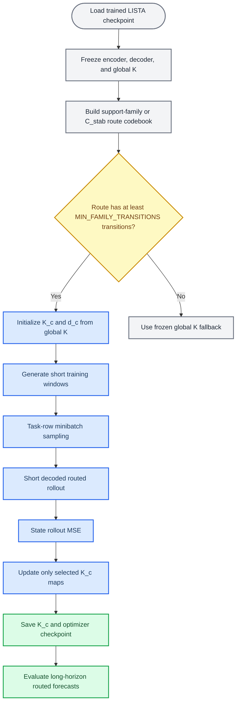

# Support-Family Local \(K_c\) Training Protocol

_Protocol note for the May 2026 routed forecasting experiments._

---

## Summary

In the current staged local-map setup, the first stage trains the normal LISTA
autoencoder and global Koopman map. The second stage freezes the encoder,
decoder, and original global Koopman map \(K\), then trains only the routed
local-map bundle. For the current reviewer-facing \(C_{\rm stab}\) runs, that
bundle contains one local affine map per retained route and a learned target
center/intercept initialized to the frozen global-\(K\) prediction.

The stage-2 loss is the same weighted model loss used by the task row, not a
new route-supervision objective. It includes decoded prediction error plus any
configured latent-alignment, reconstruction, and sparsity terms. There is no
basin-label loss, route-classification loss, route entropy loss, or explicit
\(C_{\rm stab}\) supervision during local-map training.

The frozen encoder and decoder are still used inside the computation graph:
the encoder maps initial and target states into latent space, and the decoder
maps predicted latents back to state space. Periodic decode/re-encode is used
for selection and final evaluation, not inside the stage-2 training rollout.
Their weights do not update. Route selection is non-differentiable: the current
latent is detached, converted to a support mask or matched route object, and
used to select either a trainable \(K_c\) or the frozen global \(K\).

## Objects

| Object | Role | Trainable? |
|---|---|---:|
| Encoder \(\mathrm{Enc}\) | Maps states \(x\) to latent codes \(z\) | No |
| Decoder \(\mathrm{Dec}\) | Maps latent codes \(z\) back to states \(x\) | No |
| Global \(K\) | Original checkpoint Koopman map and fallback map | No |
| Source centers \(c_c\) | Mean current-state latent for each retained route | No |
| Target centers \(d_c\) | Global-\(K\) image of \(c_c\), optionally learned as an affine intercept | Yes in the learned-intercept runs |
| Local maps \(K_c\) | Routed affine transition maps | Yes |

Each retained local map is initialized from the original global map:

\[
K_c \leftarrow K.
\]

For a routed latent \(z_t\), the source-target affine transition rule is:

\[
\hat z_{t+1} = d_c + (\hat z_t - c_c)K_c.
\]

The `source_target_affine_global_init` parameterization keeps
\(d_c=c_cK\) fixed, so every local chart starts exactly as the frozen global
map. The `source_target_affine_learned_intercept` parameterization uses the
same initialization but learns \(d_c\) during stage 2.

If the current route is not retained because it has fewer fitting transitions
than `MIN_FAMILY_TRANSITIONS`, the transition falls back to the frozen global
map. The matched Table 1 launchers use `MIN_FAMILY_TRANSITIONS=1`; older pilot
notes that mention `50` refer to the initial proof-of-concept setting.

\[
\hat z_{t+1} = K \hat z_t.
\]

## Route construction

Routes are built without basin labels, attractor labels, or known basin counts.

1. Generate fitting trajectories for the system and seed.
2. Encode them with the frozen checkpoint encoder.
3. Convert encoded latents to support masks using `absolute:0.001`.
4. For the instantaneous support-family route, merge exact supports into
   support families with greedy Jaccard threshold `0.40`.
5. For the \(C_{\rm stab}\) route, first form high-resolution support-flow
   nodes from support families with Jaccard threshold `0.80`, then infer stable
   support components from the empirical support-transition graph.
6. Count current-state fitting transitions per retained route object.
7. Retain routes with at least `MIN_FAMILY_TRANSITIONS` fitting transitions.
8. Compute \(c_c\) as the mean current-state latent for each retained route and
   initialize \(d_c=c_cK\).

The source center is therefore not learned. In the learned-intercept runs, the
target center/intercept \(d_c\) is learned after being initialized to the
global-\(K\) image of the source center.

## Training data and sampling

Each worker trains one `(benchmark, system, seed)` shard. It generates a pool
of short training windows from the same dynamical system:

- Controlled multibasin windows use the source checkpoint's short horizon,
  currently `8`.
- Dysts windows use the source checkpoint's short horizon, currently `10`.

The active staged trainer samples the same short training windows used by the
task row during stage 2. It does not launch one SLURM task per route. All
retained \(K_c\) maps for the shard are trained jointly in one local-map
bundle, with one optimizer over the whole bank of maps and target centers. A
given map receives gradients only on examples and rollout steps where it is
selected.

## Rollout, selection, and re-encoding

The active Table 1 setup uses:

- `route_freeze_mode=reroute_each_step`
- `stage2_selection_metric=best_periodic_horizon_mse`
- `stage2_selection_periods=1,2,5,10,20,25,50,100`
- `stage2_selection_horizons=100,500,1000`
- `eval_periodic_periods_override=1,2,5,10,20,25,50,100`

This means the route is recomputed before every one-step local-map application.
During stage-2 training, the local rollout stays in latent space for the short
task-row horizon; it does not periodically decode and re-encode inside the
training loss. Periodic decode/re-encode is used for model selection and final
standardized forecasting evaluation over the period grid above. The selected
checkpoint is the one with the best displayed-horizon periodic MSE over the
configured horizons.

## Objective and gradients

For a training window \((x_0,\ldots,x_H)\), the model predicts
\((\hat x_1,\ldots,\hat x_H)\). The active Table 1 rows use the inherited
weighted loss:

\[
\mathcal L =
\lambda_{\rm pred}\mathcal L_{\rm pred}
+\lambda_{\rm res}\mathcal L_{\rm latent}
+\lambda_{\rm recon}\mathcal L_{\rm recon}
+\lambda_{\rm sparse}\mathcal L_{\rm sparse}.
\]

The prediction term is decoded rollout error; the latent term aligns predicted
latents to frozen-encoder latents; the reconstruction term monitors
frozen-autoencoder reconstruction on the target states; and the sparsity term
uses the predicted latent codes. For the matched Table 1 source rows these
weights come from the task table (`pred_coeff=1`, `res_coeff=1`,
`reconst_coeff=1`, `sparsity_coeff=0.003`).

There is no route-supervision term in this experiment:

- No support classification loss
- No basin-label loss
- No route entropy or balance loss
- No spectral penalty
- No residual-local-map regularizer
- No validation-gating objective

The encoder and decoder are frozen. Gradients pass through the decoded
prediction path and latent prediction path to the selected \(K_c\) maps and
learned target centers; the target encodings themselves are computed without
updating the encoder. Route assignment itself is detached and
non-differentiable.

## Calibrated global \(K\) ablation

The calibrated-global ablation uses the same stage-2 machinery but changes the
trainable parameterization:

| Component | Local \(K_c\) run | Calibrated-global ablation |
|---|---|---|
| Trainable maps | One \(K_c\) and optional \(d_c\) per retained route | One dense \(K_{\mathrm{cal}}\) |
| Initialization | \(K_c \leftarrow K\) for every family | \(K_{\mathrm{cal}} \leftarrow K\) |
| Routing | Selects which \(K_c\) applies | Used only to balance minibatches |
| Latent update | \(d_c + (z-c_c)K_c\) | \(K_{\mathrm{cal}}z\) |
| Frozen weights | Encoder, decoder, original \(K\) fallback | Encoder and decoder |
| Loss | Inherited weighted model loss | Inherited weighted model loss |

This is a fairness ablation for second-stage calibration. It asks whether the
extra rollout-MSE training data and periodic re-encoding are sufficient on
their own, before attributing any improvement to support-family-local maps.
The same route codebook is still built so minibatches are sampled uniformly
over support-family buckets, but the selected route does not choose the
transition matrix.

## Workflow diagram



## Pseudocode

```python
def train_support_family_local_maps(checkpoint, system, seed):
    model = load_checkpoint(checkpoint, system)
    model.eval()
    freeze_all_model_parameters(model)

    encoder = model.encoder
    decoder = model.decoder
    K_global = model.kmatrix()
    train_horizon = checkpoint_sequence_length(checkpoint)  # 8 or 10

    # Build label-free route codebook.
    fit_x = generate_observation_trajectories(
        system,
        num_trajectories=fit_num_trajectories,
        trajectory_length=fit_trajectory_length,
        eval_seed=fit_eval_seed,
    )
    fit_z = encode_trajectories(encoder, fit_x)
    support_masks = absolute_support(fit_z, threshold=0.001)
    family_labels = greedy_jaccard_families(
        support_masks,
        min_jaccard=0.40,
    )

    fitted_families = []
    centers = {}
    for family in unique(family_labels.current_state_labels()):
        assigned = current_state_latents(fit_z, family_labels == family)
        if len(assigned) >= min_family_transitions:
            fitted_families.append(family)
            centers[family] = mean(assigned, axis=0)

    # One trainable bank of local maps for the shard.
    K_local = {}
    target_centers = {}
    for family in fitted_families:
        K_local[family] = trainable_parameter(copy(K_global))
        target_centers[family] = trainable_parameter(centers[family] @ K_global)

    optimizer = AdamW(
        parameters=list(K_local.values()) + list(target_centers.values()),
        lr=1e-3,
        weight_decay=0.0,
    )

    # Stage-2 training stream uses the same task-row short horizon.
    train_x = generate_observation_trajectories(
        system,
        num_trajectories=train_pool_trajectories,
        trajectory_length=train_horizon + 1,
        eval_seed=train_pool_seed + seed,
    )

    for step in range(start_step_from_checkpoint, train_steps):
        batch_indices = sample_training_windows(train_x)
        x_seq = train_x[batch_indices]
        x_true = x_seq[:, 1:]

        # Initial encoding is frozen and treated as the rollout start.
        with no_grad():
            z = encoder(x_seq[:, 0])
            z_true = encoder(x_seq[:, 1:])

        x_preds = []
        z_preds = []
        route = None
        for offset in range(train_horizon):
            # Active setting: reroute before every one-step update.
            route = route_family(
                detach(z),
                support_rule="absolute:0.001",
                family_codebook=family_labels,
                retained_families=fitted_families,
            )

            if route is retained:
                c = centers[route]
                d = target_centers[route]
                z_next = d + apply_linear_map(K_local[route], z - c)
            else:
                z_next = apply_linear_map(K_global, z)

            x_pred = decoder(z_next)
            x_preds.append(x_pred)
            z_preds.append(z_next)
            z = z_next

        loss = weighted_model_loss(
            x_pred=stack(x_preds, dim=1),
            x_true=x_true,
            z_pred=stack(z_preds, dim=1),
            z_true=z_true,
        )
        optimizer.zero_grad()
        loss.backward()
        optimizer.step()

        periodically_save_checkpoint(K_local, optimizer, step + 1)

    return K_local
```

```python
def train_calibrated_global_map(checkpoint, system, seed):
    model = load_checkpoint(checkpoint, system)
    model.eval()
    freeze_all_model_parameters(model)

    encoder = model.encoder
    decoder = model.decoder
    K_calibrated = trainable_parameter(copy(model.kmatrix()))
    optimizer = AdamW(parameters=[K_calibrated], lr=1e-3, weight_decay=0.0)

    # Build the same route codebook as the local K_c run, but use it
    # only to construct balanced route buckets.
    family_codebook = build_same_route_codebook(
        encoder=encoder,
        system=system,
        fit_num_trajectories=fit_num_trajectories,
        fit_trajectory_length=fit_trajectory_length,
    )
    train_x = generate_observation_trajectories(
        system,
        num_trajectories=train_pool_trajectories,
        trajectory_length=train_horizon + 1,
        eval_seed=train_pool_seed + seed,
    )
    with no_grad():
        initial_z = encoder(train_x[:, 0])
    route_buckets = group_window_indices_by_route(
        route_family(initial_z, family_codebook=family_codebook)
    )

    for step in range(start_step_from_checkpoint, train_steps):
        batch_indices = sample_routes_uniformly_then_windows(route_buckets)
        x_seq = train_x[batch_indices]
        x_true = x_seq[:, 1:]

        with no_grad():
            z = encoder(x_seq[:, 0])
            z_true = encoder(x_seq[:, 1:])

        x_preds = []
        z_preds = []
        for offset in range(train_horizon):
            z_next = apply_linear_map(K_calibrated, z)
            x_pred = decoder(z_next)
            x_preds.append(x_pred)
            z_preds.append(z_next)
            z = z_next

        loss = weighted_model_loss(
            x_pred=stack(x_preds, dim=1),
            x_true=x_true,
            z_pred=stack(z_preds, dim=1),
            z_true=z_true,
        )
        optimizer.zero_grad()
        loss.backward()
        optimizer.step()

        periodically_save_checkpoint(K_calibrated, optimizer, step + 1)

    return K_calibrated
```

## Resume behavior

The active Table 1 launcher runs `200000` total steps in one staged job:
`100000` joint global steps followed by `100000` local-map steps. Shards save
`last.pt` with the model, local maps, optimizer state, route metadata, RNG
state, and next step. With `RESUME_FROM_LATEST=1`, reruns continue from the
latest incomplete shard; with `SKIP_COMPLETED=1`, completed shards are left
unchanged. These two flags are now propagated from the route-baseline launcher
through the child queue script to the array runner.

---

## Proposed replacement object: stable support components

The old route object \(F_{\rm abs}\) or \(F_{\rm top8}\) is a static support
cluster: it merges exact masks when their active-coordinate Jaccard overlap is
large. That object is useful, but it is not exactly the theoretical target. A
basin of attraction is a dynamical equivalence class: two states are in the
same basin when their trajectories have the same limiting fate. The route
object we want for one-to-one basin-support alignment should therefore be
defined by support-flow fate, not only by instantaneous mask overlap.

Define a high-resolution support state \(u_t\) from an encoded trajectory.
This can be an exact \(S_{\rm abs}\) mask, or a preliminary high-resolution
support family formed with a high Jaccard threshold such as `0.8`. The
proposed object is the stable support component

\[
C_{\rm stab}(u)
\]

formed by merging support states that flow to the same recurrent support
component. \(C_{\rm stab}\) is still label-free: basin labels, attractor
identities, and known basin counts are not used to build it. They are used
only after the fact to audit whether the discovered components match benchmark
basins.

This object should not be read as a fixed-point counter. The recurrent object
is a component of the empirical support-transition graph, not necessarily a
fixed point of the original state-space dynamics. Depending on the learned
encoder and the system, a recurrent support component may correspond to a
stable equilibrium, a limit cycle, a quasiperiodic or chaotic attractor, a
long-lived metastable support pattern, or an encoder artifact. The intended
basin-support claim is therefore: one basin should map to one stable
support-flow fate, when the encoder has learned basin-aligned sparse supports.

### Post-hoc support-flow algorithm

Input:

- trained encoder \(\mathrm{Enc}\),
- trajectories sampled from the training or evaluation distribution,
- support rule \(q\), usually `absolute:0.001`,
- optional preliminary support-family threshold \(\tau_{\rm base}\), usually
  `0.8`,
- support-transition thresholds for graph construction.

Algorithm:

1. Encode sampled trajectories to latent trajectories \(z_{i,t}\).
2. Convert each \(z_{i,t}\) to a high-resolution support state \(u_{i,t}\).
   For the first trial, use `absolute:0.001` masks compressed by a high
   Jaccard family threshold `0.8`, so the graph is not dominated by one-off
   exact masks.
3. Build the empirical directed support-transition graph
   \[
   \widehat P(v\mid u)
   =
   \frac{\#\{(i,t): u_{i,t}=u,\ u_{i,t+1}=v\}}
        {\#\{(i,t): u_{i,t}=u\}} .
   \]
4. Keep graph edges whose empirical probability and transition count exceed
   small thresholds. Compute strongly connected components on this filtered
   graph.
5. Mark an SCC as recurrent if it appears in trajectory tails and has small
   outbound probability under the unfiltered transition counts. These SCCs are
   the candidate stable support attractors.
6. For every observed support state \(u\), estimate an absorption distribution
   over recurrent SCCs by scanning future supports in the same trajectory:
   \[
   a_u(c)=
   \Pr(\text{first future recurrent support component is }c\mid u_t=u).
   \]
7. Assign \(u\) to a stable support component only when the largest absorption
   probability is high enough:
   \[
   C_{\rm stab}(u)=\arg\max_c a_u(c)
   \quad\text{if}\quad
   \max_c a_u(c)\ge\rho .
   \]
   Otherwise mark \(u\) as uncertain. Uncertain states are expected near
   separatrices, rare transitions, or unsupported regions.

The discovered component count is the number of recurrent support fates that
receive high-confidence assignments. This count is inferred from support
trajectories and is not fixed to the benchmark basin count.

### Diagnostics for the post-hoc object

For each model and system, compare \(C_{\rm stab}\) to the current
\(F_{\rm abs}\) convention using:

- coverage: fraction of evaluated states assigned to a non-uncertain stable
  component;
- \(H(B\mid C_{\rm stab})\): basin uncertainty after knowing the stable
  support component;
- \(H(C_{\rm stab}\mid B)\): fragmentation of components within a basin;
- component count, compared only after the fact with the benchmark basin
  count;
- dominant-basin accuracy per component;
- one-step local-\(K\) residual when fitting one latent affine or linear map
  per component.

The desired result is not simply low \(H(B\mid C_{\rm stab})\). A degenerate
overfragmented object can make that quantity small. The target is the joint
pattern: high coverage, low \(H(B\mid C_{\rm stab})\), low
\(H(C_{\rm stab}\mid B)\), and a component count near the represented basin
count.

### Training recipe if the post-hoc object works

If \(C_{\rm stab}\) improves the post-hoc diagnostics, use it as a
self-supervised support target in a later training recipe:

1. Warm-start with the current sparse Koopman autoencoder training objective.
2. Periodically build \(C_{\rm stab}\) from the model's own encoded training
   trajectories.
3. Add a support-fate prediction head \(q_\psi(c\mid z_t)\) or a differentiable
   assignment head over stable support prototypes.
4. Train with a support-fate consistency term
   \[
   \mathcal L_{\rm fate}
   =
   \operatorname{CE}\!\left(q_\psi(c\mid z_t), C_{\rm stab}(u_t)\right),
   \]
   applied only to high-confidence assignments.
5. Add an anti-collapse term, such as marginal component entropy or a minimum
   component-usage constraint, so the model cannot satisfy the fate loss by
   assigning every trajectory to one component.
6. Add support persistence inside high-confidence components:
   \[
   \mathcal L_{\rm persist}
   =
   \mathbf 1\{C_{\rm stab}(u_t)=C_{\rm stab}(u_{t+1})\}
   \, d(q_\psi(\cdot\mid z_t), q_\psi(\cdot\mid z_{t+1})).
   \]
   The loss should not be applied across low-confidence transitions, because
   those are the states where support changes may be meaningful.
7. Train one local affine/linear \(K_c\) per stable support component:
   \[
   z_{t+1}=b_c+z_tK_c,\qquad c=C_{\rm stab}(u_t).
   \]
8. Gate each learned \(K_c\) by held-out component-level validation. Use the
   local map only when it beats the frozen global \(K\) for that component;
   otherwise fall back to the global map.

This recipe preserves the intended training/deployment constraint: it does not
use ground-truth basin labels, basin counts, or trajectory-to-basin
assignments. It uses only the model's own support trajectories as
self-supervision, then audits the discovered objects against basin labels on
benchmark systems.

### First post-hoc trial

The first implementation should be deliberately narrow:

- use existing `lista_dense_signsplit_p256_hardinit_basin_partition`
  checkpoints;
- run on the contrast systems already used by the staged local-\(K_c\) pilot:
  `cal_pentagon_5`, `transition_routes_4`, `cal_hexagon_6`, and
  `cal_octagon_8`, seeds `0` and `1`;
- build high-resolution base objects from `absolute:0.001` and
  `base_jaccard=0.8`;
- compare \(C_{\rm stab}\) against the current paper object
  \(F_{\rm abs}\) with `J=0.5`;
- fit simple ridge one-step latent maps per object as a diagnostic, not yet
  as a manuscript forecasting result.

If the stable components reduce \(H(C\mid B)\) at similar or lower
\(H(B\mid C)\), and if the one-step local maps improve over the current
support-family local maps, the next experiment should train routed local maps
using \(C_{\rm stab}\) instead of \(F_{\rm abs}\).

The next comparative test should ask whether this object discriminates encoder
families. On matched systems and seeds, LISTA-based sparse encoders should show
lower \(H(B\mid C_{\rm stab})\), lower \(H(C_{\rm stab}\mid B)\), higher
component-count agreement with the represented basin count, and higher
coverage than sparse MLP or dense/zero-sparsity MLP encoders. A positive read
would strengthen the claim that LISTA-style sparse coding gives a better
basin-support object, not merely a better static support-family read.

### Initial smoke result

The first smoke run used existing
`lista_dense_signsplit_p256_hardinit_basin_partition` checkpoints for
`cal_hexagon_6` and `cal_pentagon_5`, seed `0`, with `absolute:0.001`,
`base_jaccard=0.8`, current \(F_{\rm abs}\) Jaccard `0.5`, and
`64` trajectories of length `96`. The post-hoc evaluator completed under SLURM
job `9554713` with `12` result rows and `0` failures.

The support-object result is promising. On the per-basin deep slice,
`cal_hexagon_6` improves from current \(F_{\rm abs}\)
\(H(B\mid F)=0.4225\), \(H(F\mid B)=0\), and `4` families to
\(C_{\rm stab}\) \(H(B\mid C)=0\), \(H(C\mid B)=0\), and `6` components,
matching the six evaluation basins. On `cal_pentagon_5`, both objects are
already perfect on the per-basin deep slice with `5` objects.

The local-map result is not yet a win. The one-step affine latent probe gives
`cal_hexagon_6` a \(C_{\rm stab}\) local/global MSE ratio of `2.144`, compared
with `0.962` for current \(F_{\rm abs}\). On `cal_pentagon_5`,
\(C_{\rm stab}\) improves slightly from `3.031` to `2.950`, but both are worse
than the global map. The immediate interpretation is therefore: stable support
components may be the right object for one-to-one basin-support alignment, but
they are not yet sufficient evidence for replacing global \(K\) with local
maps. The next algorithmic step should separate support-object discovery from
validation-gated local-map use.

### Four-system contrast result

The first contrast run completed under SLURM job `9554718` on
`cal_pentagon_5`, `transition_routes_4`, `cal_hexagon_6`, and
`cal_octagon_8`, seeds `0,1`, with the same support settings as the smoke. It
wrote `48` rows with `0` failures.

On the per-basin deep slice, \(C_{\rm stab}\) achieved coverage `1.0`,
\(H(B\mid C)=0\), \(H(C\mid B)=0\), and object count equal to represented
basin count on all `8/8` system-seed pairs. Current \(F_{\rm abs}\) achieved
that pattern on only `4/8` pairs. It was already correct on `cal_pentagon_5`
and `transition_routes_4`, but it merged the six `cal_hexagon_6` basins into
`3`--`4` families and the eight `cal_octagon_8` basins into `4` families.

On all evaluated states, \(C_{\rm stab}\) has mean coverage `0.959`, mean
\(H(B\mid\cdot)=0.221\), mean \(H(\cdot\mid B)=0.384\), and mean object count
`8.12`. Current \(F_{\rm abs}\) has coverage `1.0`, mean
\(H(B\mid\cdot)=0.420\), mean \(H(\cdot\mid B)=0.486\), and mean object count
`10.2`. Thus the stable component object trades a small uncertain boundary
mass for substantially better basin-support alignment and less fragmentation.

The local-map diagnostic remains negative. On the deep slice, \(C_{\rm stab}\)
is never better than the global map (`0/8` local/global ratios below `1`) and
improves over current \(F_{\rm abs}\) on only `3/8` pairs. The next step is not
to launch a full routed local-\(K_c\) training run immediately. It is to add a
validation-gated local-map evaluator: fit candidate component-local maps, use
them only on components where held-out one-step or rollout validation beats the
global map, and fall back to global \(K\) elsewhere.

### Encoder-family comparison result

A matched two-seed encoder comparison completed on the same four systems,
using matched rows from
`transition_rich_table2_controls_p256_compact_20260502`. The roots were
LISTA dense soft-block p256, LISTA blockdiag, sparse MLP, and dense
zero-sparsity MLP. Each root completed `48` rows with `0` failures; the
combined summary is
`results/stable_support_components_encoder_compare_20260515/encoder_compare_summary.md`.

The result separates sparse-support encoders from dense MLP, but does not yet
separate LISTA from sparse MLP. On the per-basin deep slice, LISTA dense
soft-block, LISTA blockdiag, and sparse MLP all achieve coverage `1.0`,
\(H(B\mid C)=0\), \(H(C\mid B)=0\), NMI `1.0`, and basin-count agreement on
all `8/8` system-seed pairs. Dense zero-sparsity MLP collapses to one stable
support component, with \(H(B\mid C)=1.6853\), NMI `0.0`, and `0/8`
count matches.

On all evaluated states, the three sparse roots remain close:

| root | coverage | \(H(B\mid C)\) | \(H(C\mid B)\) | NMI |
|---|---:|---:|---:|---:|
| LISTA dense soft-block p256 | `0.9558` | `0.2155` | `0.3437` | `0.8383` |
| LISTA blockdiag | `0.9598` | `0.2229` | `0.3597` | `0.8319` |
| sparse MLP | `0.9746` | `0.2152` | `0.3583` | `0.8355` |
| dense zero-sparsity MLP | `1.0000` | `1.6880` | `0.0000` | `0.0000` |

Thus the current \(C_{\rm stab}\) evidence supports a sparse-versus-dense
distinction, not the stronger claim that LISTA uniquely produces the best
stable support components. A broader retained-system run or a stricter
boundary/all-state diagnostic is needed before using \(C_{\rm stab}\) as an
architecture-ranking result.

## Matched route baselines for the staged \(C_{\rm stab}\) result

The final retained controlled-multibasin staged result should be compared
against route controls that isolate the routing object from the staged
training protocol. The matched launcher is
`scripts/queue_staged_cstab_route_baselines_table1.sh`; it submits child
launchers through `scripts/queue_staged_support_family_local_k_table1.sh`.

All controls reuse the same Table 1 dense-LISTA source task table, the same
retained `15` systems and `15` seeds, the same `200000` total-step budget
(`100000` joint global stage plus `100000` local-map stage), the same training
stream seeds from the task rows, the same \(C_{\rm stab}\) fit-data size
(`512` training-distribution trajectories of length `192`), the same
learned-intercept affine local-map parameterization, and the same
best-periodic-horizon model-selection and final evaluation period grid
`1,2,5,10,20,25,50,100`.

The route controls are:

- `support_family`: the original instantaneous \(F_{\rm abs}\) support-family
  route, but run with the final learned-intercept stage-2 recipe and, for this
  matched comparison, fitted from the same `512` long training-distribution
  route-fit trajectories as \(C_{\rm stab}\).
- `oracle_basin`: a privileged benchmark-only route that uses the environment's
  basin labels at runtime after decoding the current latent state. This tests
  whether true basin routing alone explains the gain.
- `latent_kmeans`: an unsupervised dense-latent k-means partition. By default
  it matches the number of fitted \(C_{\rm stab}\) routes for the same
  stage-1 model and route-fit dataset, then routes by nearest latent cluster
  center.
- `random_matched`: a negative control that shuffles the fitted
  \(C_{\rm stab}\) route labels across the same source transitions while
  preserving the fitted route count and route-size histogram, then routes by
  nearest latent center.

These controls are intended to answer the reviewer-facing question: does the
staged local-map result come from any route partition with similar capacity,
from basin labels per se, or specifically from the label-free support-flow fate
object \(C_{\rm stab}\)?
