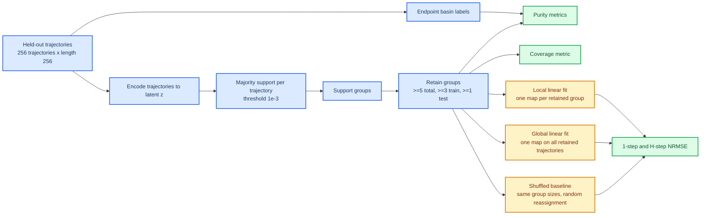

# Transition-Rich Basin-Support Metric Definitions

_Canonical definition note for the fixed-`17` basin-support reduction on April 8, 2026._

---

This document defines the basin-support metrics used in the fixed-`17`
transition-rich shortlist reduction under
[basin_support_metrics_20260408_v3](/home/mila/l/lia/skae/results/transition_rich_basin_partition_20260407/basin_support_metrics_20260408_v3).
It is intended to be the single prose source of truth for:

- what each reported metric means
- how each metric is computed
- what counts as a positive or negative read
- what the main caveats are

It complements:

- the protocol prose in
  [docs/review_main_results_tables_20260314.md](/home/mila/l/lia/skae/docs/review_main_results_tables_20260314.md)
- the implementation in
  [tools/reduce_transition_rich_basin_support_metrics.py](/home/mila/l/lia/skae/tools/reduce_transition_rich_basin_support_metrics.py)
- the low-level `NRMSE` helper in
  [tools/evaluate_lqr_readiness.py](/home/mila/l/lia/skae/tools/evaluate_lqr_readiness.py)

## 📋 Scope

This note applies to the recurring-support metrics used for the fixed
transition-rich shortlist:

- support-group purity
- weighted support-group purity
- retained trajectory coverage
- local/global/shuffled one-step NRMSE
- local/global/shuffled `H`-step NRMSE

Unless otherwise stated, the protocol is:

- `256` trajectories per system
- trajectory length `256`
- evaluation seed `42`
- trajectory `i` uses reset seed `42 + i`
- support threshold `1e-3`
- global `80/20` train/test split with split seed `42`
- retained groups require `>=5` total trajectories, then `>=3` train and
  `>=1` test trajectory after the split
- local fits use centered latent states, top-`32` PCA directions, and ridge
  regularization `1e-4`
- `H = 20`

## 🔄 Metric workflow

## 🧮 Definitions

### Endpoint basin label

Each held-out trajectory gets one benchmark endpoint-basin label, taken from
its final state. The reducer uses the environment's native basin label when
available, otherwise native attractor centers when available, otherwise a
fallback long-rollout plus `k`-means labeling procedure. The benchmark basin
count is allowed here because this is evaluation, not training-time method
design.

Implementation:

- [tools/reduce_transition_rich_basin_support_metrics.py#L350](/home/mila/l/lia/skae/tools/reduce_transition_rich_basin_support_metrics.py#L350)

### Majority support

For one trajectory with latent states `z_t in R^d`, coordinate `k` is marked
active on time step `t` if:

`|z_t,k| > 1e-3`

The trajectory-level majority support bit for coordinate `k` is then:

`support_k = 1` if the coordinate is active on more than half the trajectory
time steps, else `0`.

Equivalently, if

`votes_k = mean_t 1[|z_t,k| > 1e-3]`

then

`support_k = 1[votes_k > 0.5]`

The resulting binary vector is the trajectory's majority support.

Implementation:

- [tools/reduce_transition_rich_basin_support_metrics.py#L230](/home/mila/l/lia/skae/tools/reduce_transition_rich_basin_support_metrics.py#L230)

### Support group

A support group is the set of trajectories that share the same majority
support bitmask.

### Retained support group

A support group is retained only if:

- it contains at least `5` trajectories in total
- after one global `80/20` split of all trajectories, it still contains at
  least `3` train trajectories and at least `1` test trajectory

This is stricter than the older looser notion of a merely "recurring" support
with count `>=2`.

Implementation:

- [tools/reduce_transition_rich_basin_support_metrics.py#L654](/home/mila/l/lia/skae/tools/reduce_transition_rich_basin_support_metrics.py#L654)

### Support-group purity

For one retained support group `g`, let `n_g` be the number of trajectories in
the group and let `b_g` be the multiset of endpoint-basin labels for those
trajectories.

The support-group purity is:

`purity(g) = max_b count(b in b_g) / n_g`

So:

- `1.0` means the retained support group maps entirely to one endpoint basin
- smaller values mean the same majority support is mixing multiple basins

The reported headline `support_group_purity` is the unweighted mean across all
retained groups:

`mean_purity = mean_g purity(g)`

Implementation:

- [tools/reduce_transition_rich_basin_support_metrics.py#L666](/home/mila/l/lia/skae/tools/reduce_transition_rich_basin_support_metrics.py#L666)
- [tools/reduce_transition_rich_basin_support_metrics.py#L675](/home/mila/l/lia/skae/tools/reduce_transition_rich_basin_support_metrics.py#L675)

### Weighted support-group purity

The reducer also computes a trajectory-weighted version:

`weighted_purity = sum_g n_g * purity(g) / sum_g n_g`

This gives larger retained groups more influence than smaller retained groups.

Implementation:

- [tools/reduce_transition_rich_basin_support_metrics.py#L670](/home/mila/l/lia/skae/tools/reduce_transition_rich_basin_support_metrics.py#L670)
- [tools/reduce_transition_rich_basin_support_metrics.py#L676](/home/mila/l/lia/skae/tools/reduce_transition_rich_basin_support_metrics.py#L676)

### Retained trajectory coverage

Let `R` be the total number of trajectories that belong to retained support
groups. The retained trajectory coverage is:

`coverage = R / 256`

This asks how much of the full held-out corpus is covered by sufficiently
large, split-stable support groups.

Interpretation:

- high coverage means the support-reuse story applies broadly
- low coverage means the result may only apply to a small subset

The working gate used in the recurring-support local-linearity study is:

- strong mechanism claims should usually require coverage `>= 0.60`

Implementation:

- [tools/reduce_transition_rich_basin_support_metrics.py#L671](/home/mila/l/lia/skae/tools/reduce_transition_rich_basin_support_metrics.py#L671)
- [tools/reduce_transition_rich_basin_support_metrics.py#L674](/home/mila/l/lia/skae/tools/reduce_transition_rich_basin_support_metrics.py#L674)

### Local linear map

For each retained support group:

- concatenate the latent states from its training trajectories
- center those states by subtracting the training-state centroid
- project onto the top `32` PCA directions of the centered training states
- fit a ridge-regression linear map `y ~= xA`

This yields one fitted linear latent dynamics map per retained support group.

Implementation:

- [tools/reduce_transition_rich_basin_support_metrics.py#L425](/home/mila/l/lia/skae/tools/reduce_transition_rich_basin_support_metrics.py#L425)
- [tools/evaluate_lqr_readiness.py#L151](/home/mila/l/lia/skae/tools/evaluate_lqr_readiness.py#L151)

### Global linear map

The global baseline uses the same fitting procedure, but it pools all retained
training trajectories into one shared fit.

### Shuffled baseline

The shuffled baseline preserves the train/test group sizes of every retained
group, but randomly reassigns the retained trajectories to those groups before
fitting.

This tests whether the actual support partition carries more predictive
structure than a random partition of the same size profile.

Implementation:

- [tools/reduce_transition_rich_basin_support_metrics.py#L553](/home/mila/l/lia/skae/tools/reduce_transition_rich_basin_support_metrics.py#L553)

### One-step and H-step NRMSE

For each fitted map, the reducer evaluates:

- one-step error
- `H`-step error with `H = 20`

The exact normalized RMSE is:

`NRMSE(y, y_hat) = sqrt(mean((y - y_hat)^2)) / (sqrt(mean(y^2)) + 1e-9)`

Lower is better.

Interpretation:

- `Local < Global` means the support-conditioned local fit predicts better than
  one shared linear map
- `Local < Shuffled` means the true support grouping predicts better than a
  random grouping with the same group sizes

Implementation:

- [tools/evaluate_lqr_readiness.py#L176](/home/mila/l/lia/skae/tools/evaluate_lqr_readiness.py#L176)
- [tools/reduce_transition_rich_basin_support_metrics.py#L446](/home/mila/l/lia/skae/tools/reduce_transition_rich_basin_support_metrics.py#L446)

## 📊 Interpretation guide

| Metric | Strong positive read | Weak or negative read |
| --- | --- | --- |
| Support-group purity | Near `1.0` | Much lower than `1.0`, meaning support groups mix basins |
| Weighted support-group purity | Near `1.0` on large retained groups | Large retained groups themselves are mixed |
| Retained trajectory coverage | Above `0.60`, preferably much higher | Below `0.60`, especially if very low |
| Local vs global `H=20` NRMSE | `Local < Global` | `Global <= Local` |
| Local vs shuffled `H=20` NRMSE | `Local < Shuffled` | `Shuffled <= Local` |

The intended claim hierarchy is:

1. basin-support alignment requires high purity
2. broad support reuse requires high coverage
3. a stronger mechanistic local-linearity claim additionally requires local
   `H=20` improvement over both global and shuffled baselines

## ⚠️ Caveats

### Majority support compresses time variation

The majority-support definition reduces one full trajectory to one binary
bitmask. In transition-rich systems, a trajectory may visit multiple distinct
supports over time. This metric intentionally ignores that time variation.

Consequence:

- the metric is best read as a recurring dominant-support diagnostic, not as a
  full chart-switching diagnostic

### Threshold dependence

The support definition depends on the fixed threshold `1e-3`. If latent scales
shift across models or systems, the same underlying geometry may look more or
less sparse.

Consequence:

- purity and coverage are not completely invariant to latent rescaling

### Purity is endpoint-basin purity, not route purity

The purity metric uses endpoint basins only. A support group could be coherent
for a shared transition route or shared intermediate region while still mixing
multiple endpoint basins.

Consequence:

- the metric is aligned to the basin-support question, not to a route-support
  question

### Retention depends on one split

Whether a group survives the `>=3` train and `>=1` test rule depends on one
global random split with seed `42`.

Consequence:

- marginal groups can move in or out of the retained set under a different
  split seed

### Unweighted purity gives small groups equal weight

The headline `support_group_purity` is an unweighted mean over retained
groups. A small retained group counts as much as a large retained group.

Consequence:

- it is important to inspect weighted purity and coverage alongside the
  unweighted mean

### Local versus global is not a perfectly fair sample-size comparison

The global map trains on all retained training trajectories, while each local
map trains on a smaller group-specific subset.

Consequence:

- a local map can lose to the global map partly because it has less data, not
  only because the partition is uninformative

### The linearity test is latent-space and ridge-based

The local/global/shuffled comparison tests whether the latent dynamics are
better approximated by partition-conditioned linear maps after centering and
PCA projection. It is not a test of full nonlinear predictability in state
space.

Consequence:

- a support partition can be basin-pure without yielding the best local linear
  latent predictor

### Benchmark labeling is evaluation-only

The basin labels used here are benchmark diagnostics. They are allowed for
evaluation on benchmark systems, but they are not intended to define the
training-time method.

Consequence:

- these metrics are valid for paper evaluation, not for claiming a label-aware
  training procedure

### Current fixed-17 reduction is one-seed-per-root

The April 8, 2026 reduction uses the latest completed collected row per
`(root_label, system_key, seed)`, and the finished fixed-shortlist LISTA packet
currently corresponds to one seed per root on the full `17` systems.

Consequence:

- these numbers are informative and paper-useful, but not yet a seed-robust
  median summary

## 🔗 Implementation references

- protocol prose:
  [docs/review_main_results_tables_20260314.md#L864](/home/mila/l/lia/skae/docs/review_main_results_tables_20260314.md#L864)
- reducer:
  [tools/reduce_transition_rich_basin_support_metrics.py](/home/mila/l/lia/skae/tools/reduce_transition_rich_basin_support_metrics.py)
- `NRMSE` helper:
  [tools/evaluate_lqr_readiness.py#L176](/home/mila/l/lia/skae/tools/evaluate_lqr_readiness.py#L176)
- produced April 8 reduction:
  [results/transition_rich_basin_partition_20260407/basin_support_metrics_20260408_v3/summary.md](/home/mila/l/lia/skae/results/transition_rich_basin_partition_20260407/basin_support_metrics_20260408_v3/summary.md)
