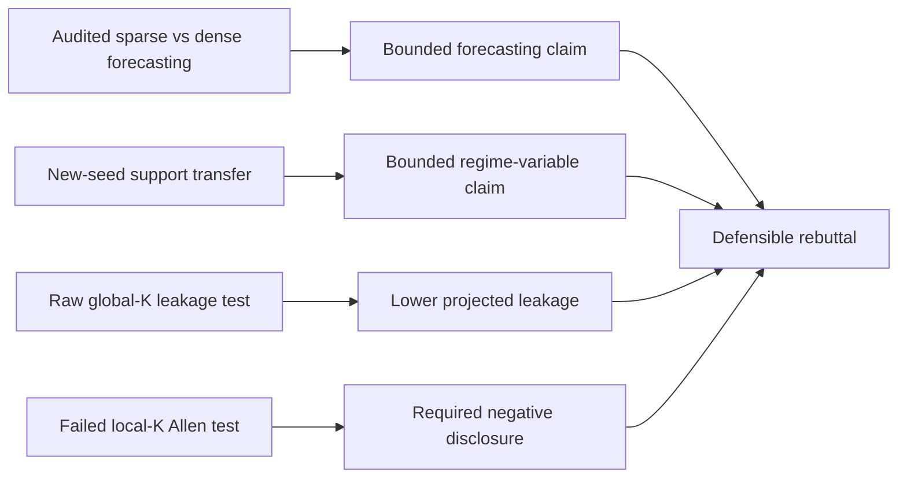

# NeurIPS Rebuttal Planning and Defense

*Evidence dossier for answering reviewer objections to `SKAE.pdf`, current as of 2026-07-21. The main TeX draft remains the source of truth for paper claims; this document owns rebuttal strategy, exact defenses, contrary evidence, and the provenance needed to check each answer.*

## 🧭 Executive position

Lead with a correction, not the submitted aggregate tables: their periodic cadence is selected on the reported trajectories and their reducer can retain finite prefixes of divergent rollouts. The primary forecasting defense must therefore be the new provenance-pinned direct-rollout evidence. An audited dense tanh control is beaten by the signed-support KAE recipe on 128-dimensional Lorenz--96 through physical time 5. A synthetic 512-dimensional, four-well reaction--diffusion PDE provides new-initial-condition-dataset multibasin evidence: conditional on a recipe whose T20 scope, Jaccard-0.40 rule, temporal weight, and whole-packet advancement were selected with validation fate metrics, its objective, representative fitting, and assignment use no labels. On unseen trajectories, the frozen sign-split support map stratifies same-time T20 final fields with ARI 0.767 against T20 modal-well fate; this is not fate prediction from \(x_0\), and the dense-support collapse does not test continuous dense values. The prospectively frozen single-well-dominated slice is exact (130/256 trajectories), but the all-trajectory uniqueness gate misses by 0.009. A separate soft-thresholded global-\(K\) model (43.4% of evaluated latent activations at \(|z|\le10^{-3}\)) has 6.30% and 5.48% lower mean field MSE through physical times 16 and 20 than an audited dense tanh KAE. With the same ten paired checkpoints and no retraining or reselection, the outcome-aware H200 advantage persists on three newly generated 256-trajectory datasets: 5.86% lower full-trajectory mean error, 8/10 paired-seed wins, exact one-sided \(p=0.00879\), and interval [2.40%, 9.21%], with a positive effect on each dataset but uncertain terminal superiority. On those identical forecasts, all seven subsequently frozen, outcome-aware H200 cumulative physical metrics favor sparse, and pixel phase, well-area, interface, full-energy, and gradient-energy errors survive Holm correction; modal accuracy and potential-energy error are positive but nonsignificant. These are correlated state-derived summaries, not PDE-residual or dissipation-law tests.

The Allen--Cahn evidence is not a blanket win. The original terminal-step intervals cross zero, H200 terminal also misses the frozen effect-size and win-count criteria, the internally frozen four-cell confirmation gate failed, and its conditional sealed holdout was not opened. The later same-checkpoint new-IC check was intentionally outcome-aware and endpoint-specific, so it validates robustness to new initial conditions for the already selected H200 through-horizon endpoint rather than retroactively making the original experiment confirmatory. The requested half-global/half-local full-matrix experiment was also negative. We should say that the PDE evidence favors the audited sparse shared-global-operator recipe for through-horizon forecasting in one condition. The negative local experiment uses a different one-seed recipe, so it does not identify global versus local parameterization for that winner.

The following causal chain is not yet demonstrated by one experiment:

\[
\text{genuine sparsity}\rightarrow\text{basin-aligned support}
\rightarrow\text{one-global-}K\text{ forecasting}.
\]

The endpoints have evidence in different models, but neither arrow is directly identified. A separate controlled-system diagnostic asks only whether label-free supports define low-leakage one-step support-projected coordinate sets for the learned \(K\). Observed leakage is below matched permutations, but the test fails its operator-differentiation guard and does not establish invariant subspaces. A final frozen multistep residual-routing test yielded no complete decision after one seed produced a nonfinite payload value (`inf`), so it adds no positive mechanism evidence.

## 📌 What the reviewers saw

The authoritative submitted binary makes three empirical claims, in language stronger than our present audit supports:

1. Sparse-latent KAEs improve long-horizon forecasting over the reported
   dense-latent controls.
2. A one-checkpoint support-coordinate intervention is interpreted as showing
   that active-coordinate identity is functionally necessary for rollout.
3. Support families fitted on held-out controlled-system states are interpreted
   as identifying basin-interior labels, while thresholded dense support
   collapses to one family.

Our audited interpretation is narrower: the first concerns best-periodic aggregate error, the intervention is one-checkpoint descriptive evidence, and the alignment partition is transductively fitted and mostly scored against nearest-center proxy labels. The staged support-family/local-affine artifact already existed in the submission commit's tree, but is absent from all 30 pages of the submitted binary and was therefore unseen by reviewers.

The submission also states that periodically decoding and re-encoding can refresh the selected local dynamics. Reviewers may reasonably ask whether this is still a linear Koopman rollout, whether the cadence was selected fairly, and why the method uses one \(K\) after motivating incompatible local laws.

The high-dimensional stress tests, requested Allen local-\(K\) experiment, raw global-\(K\) closure diagnostic, and new exact-dense controls are post-submission evidence. They should be presented as direct responses to reviewer questions, not as if they appeared in the submitted paper.

## ✅ Rebuttal-ready evidence

| Question | Concrete evidence | What it warrants | Important limit |
|---|---|---|---|
| Does the signed-support recipe survive high dimension and an actually dense control? | Lorenz--96 uses \(d_x=128,d_z=512\). Signed-support NRMSE is 6.30% lower at physical time 2.5 and 24.87% lower at time 5, wins 10/10 paired seeds, with Holm-adjusted \(p=0.003906\). The 100-step endpoint is five times the 20-step training window; sparse also beats persistence, full DMD, and rank-32 DMD at both long horizons. | High-dimensional forecasting extension against audited tanh/no-sparsity KAE. | One fixed dataset and complete-recipe contrast: LISTA/MLP parameterization and decoder normalization differ; sign splitting is structurally near half-active. |
| Is there a spatial, high-dimensional multibasin system? | Four-well vector Allen--Cahn uses a periodic \(16\times16\) grid, \(d_x=512,d_z=2048\), and evaluation through physical time 20. | A challenging spatial multibasin PDE with the required overcomplete lift and nontrivial physical horizon. | Physics-motivated synthetic system at one resolution and condition, not empirical real-world data. |
| Do support families transfer rather than merely fit the test set? | After validation fate metrics selected T20, Jaccard 0.40, the temporal weight, and advancement of the complete fixed ten-seed packet, representatives fitted without labels on original validation trajectories stratify a new-initial-condition dataset with coverage 0.982, ARI 0.767, NMI 0.730, and purity 0.923. | Same-time T20 final-field transfer conditional on a label-assisted recipe; map fitting and assignment use neither labels nor basin count. | This is not fate prediction and does not test dense latent values; all-trajectory final-state sparse uniqueness misses its 0.65 gate by 0.009. |
| Does a one-family-per-fate relation appear on a clean evaluation slice? | On the evaluation-only \(\ge90\%\) final modal-well occupancy slice prospectively frozen for the new holdout after earlier mixed-domain fragmentation, 130/256 trajectories retain all four fates and all ten seeds give exactly four families with ARI/NMI/purity/conditional entropies 1/1/1/0/0. | Exactly one transferred support family per finite-time fate in single-well-dominated final fields. | This finite-time proxy does not prove geometric basin-interior membership or alignment near interfaces/separatrices. |
| Does sparse beat dense on Allen--Cahn forecasting? | The opened comparison gives 6.30%/5.48% lower through-horizon error at \(T=16/20\). With the same 20 fixed checkpoints, three new 256-trajectory datasets give 5.86% lower H200 error, 8/10 wins, 95% interval [2.40%, 9.21%], exact \(p=0.00879\), and three positive dataset effects. On the identical fields, sparse is directionally better on all seven physical metrics; five survive Holm. | Robust lower H200 through-horizon autonomous error plus broad physical concordance under new initial conditions in the same PDE condition. | The same-checkpoint checks are outcome-aware secondary analyses, not retraining replication, cross-condition physics generalization, terminal superiority, or a repair of the failed original four-cell gate. |
| Is the dense Allen baseline genuinely dense and parameter matched? | All ten audits pass; hidden activations are tanh and every shrinkage/sparsity mechanism is absent. Both arms share trainable tensor shapes/count and the conv/decoder/\(K\) backbone, with 12,698,690 trainable parameter entries and 8,504,386 effective forward-path parameters; the evaluated latent near-zero fraction at \(|z|\le10^{-3}\) is 0.25% versus 43.38%. | Under matched parameter count/backbone, the joint soft-thresholding-plus-\(L_1\) treatment improves mean rollout error. | It does not establish equal function classes or isolate thresholding, \(L_1\), or alignment mediation. |
| Is forecast time physically meaningful? | Lorenz--96 reaches physical time 5. Allen--Cahn reports \(H=160,200\), physical times 16 and 20, with no periodic re-encoding in the new global comparison. | These are autonomous long rollouts, not nominally many tiny steps or repeated truth correction. | The forecast-focused Allen packet trains through H200, its maximum evaluated horizon; this is not temporal extrapolation beyond training. |
| Does one unchanged global \(K\) have unusually low support-projected leakage? | Across 45 sparse checkpoint evaluations, activity leakage is 0.0047 versus 0.2065 null and restricted residual is 0.0100 versus 0.1646. In the exact-dense specificity control, activity observed/null is 0.022 sparse versus 0.567 dense (ratio 0.039); residual is 0.053 versus 0.486 (ratio 0.108), with 14/14 common systems favoring sparse. | Complete-sparse-recipe-specific reduction in projected one-step leakage relative to cardinality-matched dense top-\(k\) coordinates. | Operator differentiation is null-like (0.993), and a frozen multistep residual-routing follow-up is incomplete after a nonfinite payload value (`inf`). The headline retains 45/45 sparse evaluations across 15 systems but 41/45 dense evaluations across 14; all disclosed population sensitivities are nearly unchanged. This does not establish invariant subspaces, distinct laws, boundary switching, a basis-invariant effect, or sparsity-only causality. |
| Does the predeclared \(x_0\)-support operationalization work on these Allen checkpoints? | No. A same-checkpoint, \(x_0\)-locked audit passes validity but all ten seeds form one broad support family; raw-\(K\)/null leakage is 3.29/3.25 at H160/H200 and exact dense specificity fails. | A negative test of the predeclared \(x_0\) threshold and family operationalization on these checkpoints; with zero eligible families, signature and routing estimands are undefined. | Sparse restricted still beats dense full by 5.81%/6.27%, but this reuses the forecast checkpoints and score set, does not establish mediation, and does not falsify every possible support definition. |

## 🧪 Allen--Cahn: exact scientific reading

### Representation-focused temporal-support model

This model supplies the new-initial-condition-dataset support-transfer result conditional on a label-assisted recipe. Validation fate metrics selected T20, Jaccard 0.40, the temporal weight, and whole-packet advancement; all ten seeds were retained. Both family and fate are measured from the same final T20 field, so this is stratification rather than fate prediction. The temporal objective itself was frozen before the earlier T20 test was opened, which then became development evidence. The code has near-complete pre-split group activity, and it forecasts better than dense only through time 4 (at time 20, direct/dense/sign-support RMSE-to-persistence is 0.218/0.442/0.649), so its value is a sign-split support diagnostic rather than genuine coefficient sparsity or long-horizon superiority.

### Forecast-focused soft-thresholded sparse global-\(K\) model

The fresh ten-seed comparison uses autonomous repeated applications of one learned \(K\), no periodic re-encoding, 256 fresh validation initial conditions, and paired seeds 64--73. Sparse mean error is lower in all four declared cells:

| Endpoint | Sparse | Dense tanh | Relative reduction | Paired wins | Paired-seed bootstrap CI for reduction of arm means |
|---|---:|---:|---:|---:|---:|
| \(H160\) through-horizon mean MSE | 0.04220 | 0.04503 | 6.30% | 8/10 | [2.60%, 9.54%] |
| \(H160\) terminal MSE | 0.05065 | 0.05189 | 2.38% | 7/10 | [-1.63%, 5.96%] |
| \(H200\) through-horizon mean MSE | 0.04472 | 0.04731 | 5.48% | 8/10 | [1.75%, 8.76%] |
| \(H200\) terminal MSE | 0.05890 | 0.06086 | 3.22% | 7/10 | [-0.80%, 6.70%] |

The mean-MSE ratios to persistence at H160/H200 are 0.0958/0.0938 for sparse versus 0.1023/0.0993 for dense; terminal ratios are 0.0824/0.0937 versus 0.0844/0.0968. Thus both models substantially outperform persistence at physical times 16--20, while the sparse terminal advantage remains uncertain.

We then froze an outcome-aware, endpoint-specific H200 same-checkpoint check before generating three new datasets (simulation seeds 1775404171, 74732421, and 293789188; 256 trajectories each). The same ten sparse and ten dense checkpoints were crossed with every dataset, with no retraining, checkpoint reselection, labels, or re-encoding. Averaging datasets within paired model seed, sparse/dense through-horizon field MSE is 0.04616/0.04903, a 5.86% reduction with 8/10 wins, 100,000-resample paired-seed interval [2.40%, 9.21%], and exact one-sided sign-flip \(p=9/1024=0.00879\). Dataset-specific reductions are 4.68%, 5.88%, and 7.03%. A separate authenticated recomputation reproduced every value exactly and authenticated 30/30 bound objects, including all checkpoints and the three approximately 316 MB datasets. H200 terminal is descriptive only (3.09%, 7/10). Because the H200 endpoint was chosen after the original four-cell failure, this is strong same-checkpoint new-initial-condition robustness evidence, not independent retraining replication, a reclassification of the original experiment, or evidence across physical parameters, grids, or systems. A subsequently frozen outcome-aware secondary translation scored all 256 trajectories and steps on the identical forecasts: pixel phase disagreement, well-area TV error, interface-edge disagreement, full-free-energy absolute error, and gradient-energy absolute error fall by 4.61%, 6.07%, 2.25%, 6.20%, and 8.58% (Holm \(p=0.0146,0.0352,0.0146,0.00684,0.00684\)); modal accuracy rises 0.236 percentage points and potential-energy error falls 3.77%, but these two do not survive Holm. These seven correlated state-derived summaries are not PDE-residual or dissipation-law tests; all terminal and late-window point estimates are favorable without separate inference.

Descriptively, the sparse arm-mean instantaneous MSE is lower at every evaluated time, but the running-mean reduction declines from about 14% to 5.86%; over the late half, \(T=10.1\)--20, sparse/dense instantaneous means are 0.05216/0.05380, only a 3.06% reduction. No simultaneous curve-wide inference is claimed. H200 equals the trained temporal horizon; it is a 200-step autonomous rollout, not temporal extrapolation beyond training or evidence of terminal/asymptotic superiority.

The opened development screen is directionally robust but non-confirmatory: independent selectors chose the same uniform-\(L_1\) recipe for sparse, dense, and direct arms, and the one-pass soft-thresholded sparse arm is below its same-recipe dense arm in all 16 cells across four forecast-weighting/latent-consistency recipes. Threshold 0.15 and elementwise \(L_1=0.01\) are fixed throughout, so this four-objective screen is neither an exhaustive arm-specific learning-rate search nor a component ablation. The rule frozen before confirmation-data generation required all four cells to pass and therefore failed. The conditional holdout was cancelled before execution and simulation seed 20260725 was never generated or opened. A secondary exact one-sided paired sign-flip max-\(t\) analysis gives familywise-adjusted \(p=0.014\) and 0.019 for the two nested through-horizon cells (H160 is a prefix of H200), but 0.197 and 0.112 for terminal cells. This sensitivity supports the mean-over-rollout reading without replacing the failed primary gate.

### Same-checkpoint support-subspace audit

The follow-up operationalization test was frozen before looking at its metrics and used training x0 to fit support families, score x0 to route, and no labels, future states, or periodic re-encoding. All provenance, firewall, finite-rollout, and initial-capture checks pass. The scientific result is nevertheless negative: mean active density is 0.696 (1,425/2,048 coordinates), every seed fits one family with score top-family fraction 1.0, and 0/10 rather than the required 8/10 seeds qualify for the two-family analysis. Family-specific signature and routing estimands are therefore undefined. Exact-support raw-\(K\) leakage is 3.29/3.25 times null at H160/H200; \(K-I\)-normalized leakage passes narrowly at H160 (0.798) but misses at H200 (0.804); matrix \(K-I\) leakage is 0.531 over the 0.50 ceiling; global-\(K\)-over-identity is 1.052 over its 1.0 ceiling; and all six matched-dense specificity cells fail.

Fixed-support forecast retention does pass. Sparse restricted forecasts beat dense full by 5.81% at H160 (8/10, 95% interval [1.58%, 9.55%]) and 6.27% at H200 (8/10, [2.20%, 9.87%]). But the sparse restriction factor is slightly worse than dense at both horizons (ratios 1.0147 and 1.0130; 1/10 wins), while ordinary sparse full rollout already beats dense full. This is therefore a same-checkpoint decomposition of the forecast result, not independent evidence or a support-mediated mechanism. The conditional bridge required at least eight two-family seeds; with zero eligible it was a formal no-go and was not launched.

### Requested half-global/half-local model

At one frozen model seed, the experiment followed the requested split: joint global training, then freezing the encoder, decoder, and global \(K\) while training four full route-local operators \(K_f=K+\Delta_f\) plus biases, initialized at \(\Delta_f=0\) (16,777,216 slope parameters; 16,785,408 trainable parameters total; 4.66 GB peak allocated). Sparse-support, sparse cosine-k-means, and dense cosine-k-means routes were built from training fields and latents without labels or a known basin count; a continued-global branch received the matched remaining budget. Even validation initial conditions selected checkpoints and learning rates; the values below use report-only odd initial conditions. Unlike the positive direct global model, this different recipe refreshes through decode--encode every 40 forecast steps. It failed:

- All six branches (three routing arms by two learning rates) selected the zero-update initialization.
- Sparse local \(H200\) through-horizon mean MSE was 0.07871 versus 0.06463 for sparse
  global, 21.8% worse.
- Sparse local terminal MSE was 0.12048 versus 0.10168, 18.5% worse.
- Worst-horizon predicted route coverage was 0.8398, below the 0.90 gate.
- The ancestor's pre-split activity was 0.9982, so it was not genuinely coefficient-sparse despite exact sign-pair exclusivity.

This rules out insufficient matrix dimension or rank as the sole explanation for this seed, not routing error, conditioning, allocation, or optimization. Its sequence-80 near-dense ancestor differs from the positive sequence-200 genuinely sparse recipe; do not present it as a same-recipe causal comparison. The [frozen packet](figures/neurips_paper_2026/_data/allen_cahn_half_global_half_local_negative/evidence_manifest.json) preserves byte-identical protocol/result roots `ebcd3120...`/`e8ed176a...` and the raw checkpoint/evaluation roster. `uv run skae-paper build allen-cahn-half-local --check` checks the portable compact packet; the module's separate `--check-sources` mode rehashes raw files when the source archive is mounted.

## 🔬 Can one matrix encode several local laws?

The defensible hypothesis is coordinate-basis dependent: support family \(f\) selects a coordinate set \(S_f\), and the single learned matrix may contain approximately invariant restrictions, \(K\approx\bigoplus_fK_f\); overlapping supports additionally require the restrictions to agree on their intersections. The implementation uses row codes, \(z_{t+1}=z_tK\), so for \(z=zP_f\),
\[
zK=zP_fKP_f+zP_fK(I-P_f).
\]
It measures the second term; in the paper's column convention the same check is \((I-P_f)KP_f\). Small coupling is a necessary geometric condition under which restrictions \(K_f=P_fKP_f\) could act as support-selected laws, but it is not sufficient: the observed restrictions must also be meaningfully different, a gate the current experiment fails.

An exact existence construction clarifies why one matrix is not itself a contradiction. For row-form affine laws \(x^+=xA_b+c_b\), lift with \(\psi_b(x)=[x,1]\), set \(K_b=\left[\begin{smallmatrix}A_b&0\\c_b&1\end{smallmatrix}\right]\), and let the overcomplete operator be \(K=\operatorname{diag}(K_1,\ldots,K_B)\). If a routed basin-interior encoder places \(\psi_b(x)\) only on support block \(b\), then \(P_bK(I-P_b)=0\) and \(zP_bK^h=zK^h\), while different restrictions contain different local laws and a block-aware decoder recovers the state. This proves an algebraic interior-chart possibility, not a continuous global encoder across basin boundaries, learned discovery, label-free routing, or realization by the trained checkpoints; unused latent blocks also mean the architecture need not be told the realized \(B\).

### Frozen protocol and result

- **Checkpoint roster:** unstructured signed LISTA with full \(d_z=256\)
  global matrices, three seeds on each of 15 author-defined two-dimensional
  controlled systems; latest valid checkpoint per system and seed.
- **Data separation:** 128 new trajectories per checkpoint, split 64/64 by
  whole trajectory. The first half forms label-free support representatives;
  the second half is score-only.
- **No oracle structure:** neither basin labels, basin counts, attractor IDs,
  nor trajectory assignments enter family construction or scoring.
- **Support rule:** \(|z_i|>10^{-3}\), greedy Jaccard-0.50 representatives,
  with families retained only when the fit half supplies at least 128 source
  transitions.
- **Slices:** the internally frozen primary requires current/next family
  persistence. The evaluator also emitted an all-current, no-next-state regime
  before execution; its post-hoc reduction is a guard, not a second decision.
- **Unmodified-\(K\) closure:** report both Frobenius coupling and leakage of
  the support-projected input \((zP_f)K\). This does not claim unrestricted
  \(zK\) stays inside the support.
- **Near-identity guard:** also normalize the same cross-support output by
  actual change energy, reporting
  \(\|(zP_f)K(I-P_f)\|/\|(zP_f)(K-I)\|\) and
  \(\|P_fK(I-P_f)\|_F/\|P_f(K-I)\|_F\). This prevents an almost-identity
  matrix from looking invariant merely because it changes little.
- **Prediction guard:** compare full global-\(K\), identity, and the post-hoc
  restricted predictor \(P_fKP_f\). The latter is clearly labeled as a
  diagnostic, not the trained model.
- **Transport guard:** report encoded-next outside-support energy relative to
  the current family and require global \(K\) not to underperform identity.
- **Null:** 16 frozen sign-pair-preserving coordinate permutations. The same
  permutation is applied to codes, family masks, and coordinate projectors
  while \(K\) stays fixed, preserving norms, activity, support cardinality,
  and sign semantics while breaking alignment with \(K\).
- **Nontriviality:** quantify pairwise distance between \(P_fKP_f\) operators
  and require it to exceed the matched-null distance rather than accepting a
  near-identity \(K\) as evidence.
- **Eligibility:** at least two retained families, held-out current coverage
  at least 0.80, persistent coverage at least 0.70, and at least 64 scored
  transitions per reported family.
- **Strong gate:** at least 36/45 runs and 12 systems eligible; persistent
  activity leakage at most 0.35; true/null leakage ratio at most 0.80 with a
  true-null win on at least ten systems; activity change leakage at most 0.50
  with true/null ratio at most 0.80 and a true-null win on at least ten
  systems; restricted residual true/null ratio
  at most 0.85 with a win on at least ten systems; next-state outside energy
  at most 0.35; global-\(K\)/identity residual at most 1; and operator-distance
  true/null ratio at least 1.10.
- **Expansion rule:** if coverage alone invalidates the experiment, expand to
  256 trajectories once. Do not alter support thresholds or outcome gates.

All 45 runs and 15 systems are eligible, with mean current/persistent coverage 0.963/0.953; representatives average 95.0/256 coordinates and capture 0.997 of source-code RMS energy. On the all-current guard, true/null activity leakage is 0.0047/0.2065 (ratio 0.022), whole-matrix leakage is 0.0538/0.2080 (0.240), their \(K-I\)-normalized values are 0.338/0.783 (0.433) and 0.554/0.783 (0.699), and restricted residual is 0.0100/0.1646 (0.053); all five favor the learned supports on 15/15 systems. Removing the next-family condition leaves the aggregate essentially unchanged on this 95%-persistent sample, but the guard adds only 3,527 transitions (0.96 percentage points) and therefore does not determine boundary-switching behavior.

The frozen strong decision nevertheless fails: restricted-operator distance is 0.974 versus 0.983 null, ratio 0.993 rather than 1.10. Its branch is named **partial closure**, but the reviewer-facing result is narrower: basis-specific support-projected one-step leakage below matched permutations, not invariant charts, closure of whole coordinate subspaces, distinct local laws, or a direct-sum decomposition.

The triggered specificity follow-up is complete with 45 newly trained dense-tanh, zero-weight-decay checkpoints. It uses the same physical states and, at every state, selects the top-\(k\) dense coordinates where \(k\) exactly equals the paired sparse support cardinality. Forty-one dense runs and 14 systems satisfy the source-locked reducer eligibility rule. For raw-\(K\) activity leakage, sparse and dense observed/null ratios are 0.022 and 0.567 (sparse/dense 0.039); for post-hoc restricted residual they are 0.053 and 0.486 (sparse/dense 0.108). All 14 common systems favor sparse on both. The reducer's at-least-two-eligible-seeds system rule existed before outcomes but was omitted from the card, and the frozen headline uses 15 sparse versus 14 dense systems. Common-14, literal-card all-15, and all-three-seed 12-system sparse/dense sensitivities are 0.039/0.108, 0.040/0.109, and 0.041/0.110. This attributes coordinate alignment to the complete sparse recipe relative to the exact-dense matched-mask recipe, not to sparsity alone: encoder/decoder parameterization and optimization differ, and dense top-\(k\) masks do not have natural dense-support semantics.

The result warrants only basis-specific projected one-step leakage below matched permutations, not a decoded/multistep forecast or invariant subspaces. A prospectively frozen physical-space GatedLocalLinear test used evaluation-only basin labels/count to match label-free families to the known laws and returned identity-optimal slope assignments in all nine seed--basin rows: across sparse seeds 0/1/2, support-block own-law relative errors are 0.244/0.322/0.453, own/nearest-wrong ratios 0.337/0.445/0.702, and identity/best-derangement assignment ratios 0.372/0.501/0.453. Its formal decision is **invalid**, so these values support no law conclusion: seed 0 anchor-update/true-RMS is 0.302 over the 0.25 ceiling; seed 1 local-fit residual is 0.290 and anchor ratios reach 0.452/0.283. Treat them only as exploratory motivation; do not relax v1 after access. The genuinely new-seed V2 adjudication follows.

### Distinct-law adjudication: negative mechanism result

V2 used new paired sparse/dense seeds 100--109 on a controlled 2D three-law system. Training and label-free support-family discovery used neither basin labels nor the basin count; labels were used only to match and score benchmark laws. The authenticated packet and independent supplemental audit agree exactly, but the frozen mechanism decision is **invalid/negative**: joint sparse differentiability coverage is 24/30 rather than at least 27/30, leaving only 6/10 complete sparse seeds rather than 8/10. On those 24 rows, the actual restricted-predictor Jacobian recovered the correct law in only 9/24 nearest-law comparisons, 4/24 ratio gates, 2/24 affine gates, and 0/24 finite-radius gates. No sparse seed passed its H gates.

The isolated \(K\)-induced component is diagnostically interesting but insufficient: its correct law is nearest in 24/24 valid rows, its nearest/wrong ratio passes in 24/24, and projected-code closure is at most 0.50 in 23/24. Yet the G comparison loses its aggregate null guard (null wins 6/10, \(p=0.377\)), and the actual predictor including encoder--decoder reconstruction does not recover the laws. Dense-relative specificity is invalid because only six pairs are jointly kink-complete; fixed-ten adverse completion fails. This experiment therefore supports neither several learned local laws, invariant subspaces, nor sparse superiority. The contrast only motivates prospective tests of reconstruction geometry; it does not identify reconstruction as the cause, and its gates will not be relaxed after outcome access.

### Residualized multistep follow-up: invalid and directionally unadjudicated

A final prospectively frozen test recursively composed a label-free support-routed residual map with one unchanged \(K\) on three new 131,072-trajectory corpora, against global, residual-global, routed-nonresidual, 32 matched-null, persistence, and exact-dense controls at physical times 8 and 20. The blind smoke formally passed, and recorded per-task telemetry for all six allocated A100 compute windows met the frozen thresholds (97.21--98.62% mean compute utilization), but the required all-ten scientific telemetry gate never ran. Five shards completed under quarantine; task 5 (model seed 105) produced a nonfinite payload value (`inf`) and strict serialization failed; the remaining four tasks and dependent summary were cancelled. Because the frozen card requires all ten shards and complete finite endpoints and forbids finite-prefix, survivor, or non-finite-replacement scoring, the test is invalid at the frozen validity tier and directionally unadjudicated: there is no readable performance contrast and no evidence for or against the routed one-\(K\) forecasting hypothesis. The traceback identifies neither arm nor endpoint and cannot distinguish a non-finite predicted state from metric overflow. The partial shards remain uninspected; no outcome-adaptive repair or fourth run is permitted.

## 🧯 Rechecked historical evidence

Several prior experiments anticipated reviewer questions, but their protocol
determines how much weight they deserve.

| Prior evidence | Concrete result | Valid use | Why it is insufficient alone |
|---|---|---|---|
| Controlled benchmark forecasting | Every displayed sparse KAE aggregate is below Dense MLP; controlled H1000 Dense MLP error is roughly 17--27 times the sparse rows. | Shows broad empirical advantage on the submitted procedural systems. | Test-selected cadence, finite-prefix omission, only eight repeated training batches, architecture/normalization differences, and seed-within-system inference remain. |
| Dysts stress test | Sparse aggregates remain lower, with row-specific significance rather than a universal win. | External chaotic-flow robustness. | Not multibasin ground truth, heterogeneous physical horizons, and the same periodic/finite-prefix issues. |
| Controlled support alignment | On 14 informative systems, LISTA has 0.138 nats \(H(B\mid F)\) versus 1.37 for Dense MLP. | Post-hoc association with native/proxy evaluation labels on high-margin states. | Partition and most proxy centers are transductively fit on the same evaluation collection. |
| Controlled coordinate/support interventions | At H21, standard accumulated MSE is 0.0158; dropping the top 1/2/3/5/10 coordinates gives 0.508/1.37/2.08/3.26/8.51. In a distinct state-bridge intervention, re-encoding the controlled current true state gives sparse target-family rates 0.994--1.000 versus 0.009--0.019 without transfer; plain-LISTA period-20 stale/refreshed rates are 0.9630/0.9997. | Coordinate identity matters to one fitted predictor, and an encoder can refresh support identity after a controlled regime move. | One-checkpoint/off-manifold evidence and a true-state, center-geometry-controlled intervention; neither is autonomous decode--encode forecasting or mediation. |
| Staged support-family local maps (pre-existing, but absent from the submitted PDF) | Support-family H1000 routed/global is 0.328 with 189/225 wins; matched random-count, latent-k-means, and oracle-basin routes are also 0.451 (185), 0.341 (196), and 0.366 (195). | Local affine maps broadly help this staged artifact. | K-means/oracle are at least as strong and random is strong, so support identity is not uniquely causal; route-fit duplication, selector leakage/asymmetry, nesting, and test-selected cadence remain. |
| Jaccard-threshold sensitivity | A completed 1,345-run sweep (15 systems, up to 15 seeds, 24,210 rows, zero failures) finds LISTA \(F_{\rm abs}\) \(H(B\mid F)\) 0.0925/0.0543/0.0385 around \(J=0.4/0.5/0.6\), versus dense 0.7648, but \(J=0.2\) merges to 0.6858 and \(J=0.9\) fragments to 33.8 families with entropy near zero. | Answers local robustness around the reported threshold and establishes that family count must accompany entropy. | Transductive deep evaluation slice with known-count proxies; threshold is a resolution parameter, not an innocuous invariant. |
| Historical dense-tanh tail-fate router | Across 75 rows, a zero-explicit-sparsity tanh KAE's continuous tail-fate local maps beat its dense global anchor 73/75, 71/75, 71/75 at H100/500/1000 (H1000 median ratio 0.0418), but beat the sparse staged recipe on only 0/75, 2/75, 2/75; dense/sparse geometric-mean ratios are 54.96/94.03/104.35. | Dense latents can encode routable fate, while the historical sparse routed recipe forecasts much better. | Five seeds, different route definitions, AdamW weight decay \(10^{-4}\), staged selector leakage, and test-selected cadence; not sparsity causality and not yet a compact paper packet. |
| April centered-chart packet (authenticated historical audit) | In relative-0.1/q4 persistent support rows with defined comparisons (block/full-\(K\) sparse/dense: 121/139/140), local-refit/learned-\(K\) medians are \(5.48\!\times\!10^{-4}/2.29\!\times\!10^{-4}/1.10\!\times\!10^{-4}\); unchanged-\(K\) input-mask medians are \(1.13\!\times\!10^{-3}/8.95\!\times\!10^{-4}/1.31\!\times\!10^{-4}\). Full-\(K\) sparse local/refit-global is only 0.967; its local-over-random/k-means medians are 0.446/1.000. A one-seed true-geometry probe gives full-sparse observed/random state-Jacobian error 0.0916/0.153. | Shows that post-hoc centered restriction can repair these checkpoints and motivates a clean learned-\(K\) closure test. | Supports/prototypes are transductively constructed before a transition split; q4 uses evaluation labels; k-means/random controls are competitive; dense is at least as strong; sparse roots use known system-specific block counts. The geometry probe fits new slopes, not the checkpoint \(K\). Dense has weight decay \(10^{-4}\) and one ReLU checkpoint among 170; exact dirty runtime source is unrecoverable. |
| April self-routed packet (authenticated historical audit) | Full-\(K\) sparse top-8 H1000 support-gated/support-local/family-local medians are 0.228/0.275/0.00218 versus global \(K\), with 69/71/56 wins among 75 finite ratios and median coverage 0.529/0.525/0.572. The gated and family-local means are \(9.14\times10^9\) and \(7.09\times10^{11}\); dense family-local median is 54.59. | Label-free routing on fresh seed-314 trajectories can repair some surviving direct rollouts after operators fit on disjoint seed-42 trajectories. | No re-encoding, but the reducer averages finite per-IC prefixes and modes have different survivors; 38/170 full-sparse global/gated rows lose valid steps. Top-8 was selected after two rules, coverage is partial, tails are catastrophic, and the dense control is not architecture/capacity or zero-regularization matched. |
| April raw-\(K\) support-flow attempt | Three seed-0 smoke cases put 0.9927--0.9959 of deep relative-threshold one-step output energy on the current support. A cancelled 25/120-run block-diagonal partial packet averages 0.9885, but top-8 masks average only 0.5172. | Motivates a properly held-out closure experiment and shows strong threshold sensitivity. | No completed roster, manifest, summary, dense control, matched null, prediction guard, or multi-step forecast; the partial roster is structurally block-diagonal. |
| Five-system spatial reaction--diffusion expansion | Grid-16 \(d_x=512,d_z=2048\), five systems and five seeds, 125 trained runs. At \(T=3.2\), dense tanh field MSE is 1.452 versus 1.536/1.536/1.549 for three sparse rows; at \(T=6.4\), dense is 1.646 versus 1.747/1.928/1.881 with some sparse failures. One sparse support row nevertheless has normalized \(H(B\mid F)=0.0486\). | Demonstrates that an earlier overcomplete spatial multibasin expansion and negative dense comparison already existed; supports a representation/forecasting separation. | Labels/support thresholds are post-hoc, trajectories are small in number, H512 is unusable, and the forecasting result directly refutes any universal sparse advantage. |
| Three-seed Allen--Cahn H200 precursor | Grid-16 \(d_x=512,d_z=2048\), physical time 4: direct LISTA mean/terminal field MSE is 1.114/1.142 versus dense tanh 1.174/1.363. Frequent periodic re-encoding usually worsens the long rollout; the best LISTA H200 mode is direct. | Earlier evidence that the physically longer, no-re-encoding endpoint can reveal a sparse advantage hidden at short horizons; it motivated the stronger frozen confirmation. | Only three seeds, short physical time, large absolute errors, and no confirmatory inference; superseded by the ten-seed \(T=16,20\) result. |
| Fifteen-seed higher-dimensional hard-system redo | On fixed eight-basin competitive Lotka--Volterra, Hopfield \(N=P=16\), and identical-frequency Kuramoto \(N=16\), \(d_z=1024\) tanh Dense MLP beat all five sparse/LISTA recipes on all three systems at H100/H500/H1000. At H1000 its system medians are 0.2999/2.8034/7.7872 versus 0.3210/8.3277/15.5167 for the closest LISTA-SB row. | Mandatory negative stress test: sparse advantage is not universal. | Evaluation-selected best-periodic cadence; AdamW weight decay \(10^{-4}\); activation, LISTA, block-\(K\), capacity, and learning-rate differences make this a recipe comparison, not sparsity-only causality. |
| Earlier fixed-cadence Kuramoto ablation | On one \(N=16,\Delta t=0.00625\), 200k-step condition, fixed `periodic_100` exactly preserves the best-periodic H1000 ranking: block-diagonal LISTA 6.98, dense-transition LISTA 13.84, sparse MLP 27.02; at H500 sparse MLP remains better. | Rechecks that cadence search is not the sole cause of this one structured-transition long-horizon ranking. | One system/condition and an autonomous nonlinear composite periodic predictor; it is neither direct global-\(K\) evidence nor a dense-latent sparsity-causal comparison. |
| Label-free local polynomial EDMD provenance audit | The frozen 225-row audit **failed** exact historical reproduction: 144 rows and all six aggregates mismatch. Current controlled H100/H500/H1000 values are 0.1495/0.2509/0.2737; current Dysts H100/H2000/H4000 values are 0.00158/2.176/2.981, versus historical 0.000501/2.171/2.966 on Dysts. | Negative provenance result: withdraw this control from the rebuttal rather than treating it as authenticated switching evidence. The current packet may be discussed only as an unmatched current-environment reconstruction. | June ran an unrecorded dirty tree; its logged commit lacks the evaluator, and its Numba-enabled chaotic simulator differs from the current non-JIT environment. Selected \(k\), finite coverage, and component counts change, so this is not harmless numerical drift. |
| Current-roster autonomous self-routing | Against the paper's best-periodic baseline, family-local routing wins 0/15 controlled and 0/10 Dysts systems at every reported model/horizon; controlled LISTA H1000 is \(1.65\times10^{22}\) versus 0.166. | Strong falsification of the idea that the current support router is already deployment-competitive. | Best-periodic itself is test-oracle; the comparison still shows that autonomous routing is catastrophically unreliable. |
| ManiSkill insertion pilot | Sparse MLP mean H10--H50 state MSE is 0.001837 versus 0.002023 for dense tanh. | Pipeline-only indication that a controlled extension is technically possible. | Only 20 source episodes produce 100 rollouts; intended outcome labels are not observed, 85/100 failures are untyped, key contact features and the source dataset are missing. It is invalid as realistic multibasin evidence. |
| DeepMind Control state suite | A 240-run, four-task random-policy suite is negative: at full data, H50 MSE is 0.297 for MLP, 0.460/0.616 for dense bilinear/additive, and 0.693/1.062 for sparse bilinear/additive. | Transparent application-style negative exploration. | State-only simulator data, no basin labels, pixels, control policy, or empirical system; many nominally sparse matrices remain about 99% dense. Summary/manifest hashes are `73d8a6b1c73116426e0d30c5fbf1e288b4544ca182f6f97731a6543450d82346`/`32c1abf0d3fd5b7f8280f66d5f745b645ca47f49ec0bc3cb05ff83c9f816e97f`. |
| ManiSkill-10 smoke | Ten official tasks were prepared, but only PickCube and PlugCharger were trained for one seed and 5k steps; sparse sometimes wins best-periodic long-horizon MSE. | Pipeline feasibility only. | Incomplete roster, one seed, test-selected cadence, low outcome entropy, and explosive direct LISTA PlugCharger rollout; not multibasin evidence. |

The April packets must not be cited as proof that the unmodified learned \(K\)
contains basin-invariant subspaces or that sparsity alone causes local laws.

## 🥊 Adversarial response matrix

| Likely objection | Status | Rebuttal answer | What we must concede |
|---|---|---|---|
| “There is no challenging high-dimensional or realistic multibasin system.” | Strong dimensional answer; partial realism answer. | Point to \(d_x=128\) Lorenz--96 and the spatial \(d_x=512,d_z=2048\) four-well PDE through physical time 20. | Allen--Cahn is synthetic, one grid and condition; no empirical real-world multistable field system. |
| “Sparse does not forecast better than dense on the PDE.” | Strong same-checkpoint new-IC robustness and physical-concordance evidence; bounded scope. | Without retraining, the effect persists on three new initial-condition datasets: 5.86% lower H200 full-trajectory mean error, interval [2.40%, 9.21%], exact \(p=0.00879\), 8/10 seed wins, all three dataset effects positive, all seven physical metrics directionally positive, and five Holm-significant. | Endpoint and physics analyses are outcome-aware; terminal superiority, independent pipeline replication, cross-condition generalization, and the original four-cell conjunction remain unsupported. |
| “Your dense baseline is sparse because of ReLU or regularization.” | ReLU premise false; regularization caveat resolved only in new controls. | The submitted Dense MLP already used tanh hidden activations, a linear latent output, and \(\lambda_{\rm sp}=0\), so it was not a ReLU-sparse strawman. New Lorenz/Allen dense arms additionally remove weight decay, shrinkage, dropout, and transition/block penalties under fail-closed audits. | The submitted dense arm used AdamW weight decay \(10^{-4}\), and older cross-family comparisons do not isolate every architectural difference. |
| “Why motivate multiple local laws but learn one \(K\)?” | Exact representational possibility and lower projected one-step leakage; the learned distinct-law test is negative and the multistep test unadjudicated. | A routed-interior direct-sum affine lift shows one matrix can contain support-selected laws in principle. Empirically, the no-next-state guard has much lower leakage than matched permutations, with activity/residual specificity 0.039/0.108 relative to exact-dense cardinality-matched masks. | Operator differentiation is null-like, the distinct-law packet is negative, and the final residual-routing packet is incomplete after a nonfinite payload value (`inf`); there is no learned multistep or invariant-subspace claim. |
| “The half-global/half-local scheme should work if supports are useful.” | Negative one-seed result. | Full route-local matrices with matched continuation did not improve for the tested recipe. | It is not a same-recipe comparison to the positive global model and does not refute all local methods. |
| “Periodic re-encoding makes the predictor nonlinear.” | Resolved for post-submission direct confirmations; a submitted-table limitation. | Lorenz and forecast-focused Allen use provenance-pinned repeated-\(K\) rollout without re-encoding. | Submitted best-periodic values are autonomous nonlinear composite predictors, not uniformly \(K^h\) or guaranteed projections. |
| “Periodic cadence was selected on test data.” | Confirmed by implementation audit. | The PDF main text says training-set tuning, but its appendix and code select the best held-out score; we correct this and lead with direct rollouts. | Equal cadence grids do not make per-cell evaluation selection a validation-frozen deployment policy. |
| “Support families use labels or the known basin count.” | Mixed: Allen map formation/assignment are label-free, recipe selection is not. | Conditional on its selected recipe, Allen's objective, representatives, and new-IC holdout assignment use neither labels nor count. | Validation fate metrics selected T20, Jaccard 0.40, temporal weight, and full-packet advancement; controlled proxies use known count for evaluation, while BD/SB diagnostics also use it to size transition blocks. |
| “A better representation is useless if forecast does not improve.” | Answer with task-specific utility. | One model improves through-horizon prediction; a different model transfers fate stratification and localizes interface-associated support fragmentation. | Routing/control remain prospective; alignment is not a forecasting guarantee or demonstrated mediator. |
| “Coordinate interventions prove causal support semantics.” | Not established. | Treat them as descriptive evidence that coordinate identity matters. | No cross-system causal mediation or on-manifold intervention. |
| “Statistics treat seeds as independent systems.” | Not the submitted testing rule. | Controlled tests use paired seeds within each fixed system; Dysts sign tests use systems as units. | These quantify repeatability on fixed rosters, not population generalization over environments or PDE conditions. |
| “This is component assembly, not a new method.” | Argument; experimental baseline gap remains. | Novelty is the label-free basin-support formulation and diagnostics; the new direct-rollout and support-transfer evidence test its stated consequences. | The local-polynomial comparator failed provenance reproduction. A capacity-matched H200 neural forecaster reached 88.86% mean GPU utilization but failed its frozen p10 gate (56% versus 80%) before any scientific checkpoint/outcome, so a matched modern switching/local-Koopman baseline remains absent (archive `adc57f7f...`). |

## 💬 Exact answer bank

### High-dimensional and multibasin criticism

> We agree that the submitted low-dimensional suite left this question open.
> We therefore tested two four-times-overcomplete settings without changing
> the dense comparator into a sparsity-producing network. On 128-dimensional
> Lorenz--96, sparse improves NRMSE by 6.30% and 24.87% at physical times 2.5
> and 5 over an audited dense tanh KAE, winning all ten paired seeds. The
> time-5 endpoint is five times the training window, and sparse also beats
> persistence, ordinary DMD, and rank-32 DMD at both long horizons. On a
> 512-dimensional four-well reaction--diffusion PDE, validation fate metrics
> selected T20, Jaccard 0.40, the temporal weight, and advancement of the full
> fixed ten-seed packet; conditional on that recipe, its objective,
> representative fitting, and holdout assignment use no labels. The frozen map
> transfers to a new-initial-condition dataset with ARI 0.767 between same-time \(T=20\) final-state
> families and \(T=20\) modal-well fate, becoming exactly one family per fate on
> a single-well-dominated slice prospectively frozen for the new holdout after
> earlier mixed-domain fragmentation.
> This exact one-family-per-fate result covers 130/256 trajectories; the
> all-trajectory final-state uniqueness gate still misses by 0.009.
> These experiments extend evidence to one high-dimensional chaotic benchmark
> and one spatial synthetic multibasin PDE, while we do
> not present the synthetic PDE as real-world validation.

### Allen--Cahn forecasting criticism

> In a separate forecast-optimized Allen--Cahn comparison using autonomous
> global-\(K\) rollout, the soft-thresholded KAE (43.4% of evaluated latent activations at \(|z|\le10^{-3}\)) reduces mean field
> MSE over rollout states by 6.30% through \(T=16\) and 5.48% through \(T=20\) relative to an
> audited dense tanh KAE with the same trainable tensor shapes/count, effective forward-path parameter count, and shared backbone.
> The treatment jointly adds soft-thresholding and \(L_1\); it is not a component
> ablation. We next froze H200 through-horizon error and evaluated the same
> checkpoints on three new 256-trajectory datasets, without retraining or
> reselection. Sparse is 5.86% lower (8/10 paired-seed wins; 95% interval
> [2.40%, 9.21%]; exact \(p=0.00879\)), and all three dataset effects are
> positive. We average the three datasets within each paired checkpoint seed,
> so the inferential sample is ten paired seeds, not 30 seed--dataset cells;
> dataset-specific effects are descriptive. This outcome-aware endpoint-specific same-checkpoint check establishes
> robustness to new initial conditions in the same PDE condition, not independent retraining replication. On the identical forecasts, all seven subsequently frozen physical metrics favor sparse; pixel phase, well-area, interface, full-energy, and gradient-energy errors improve by 4.61%, 6.07%, 2.25%, 6.20%, and 8.58% and survive seven-way Holm correction, whereas modal accuracy (+0.236 percentage points) and potential-energy error (3.77% lower) do not. These correlated state-derived summaries are outcome-aware secondary concordance, not PDE-residual or dissipation-law tests and not a new primary endpoint. Both original terminal intervals cross zero, and H200 terminal
> also misses the frozen 5% effect-size and 8/10-win thresholds; therefore the
> internally frozen four-endpoint confirmation criterion was not met. We
> report this same-checkpoint check beside, not pooled with, the original failed gate.

### One global matrix criticism

> In principle, support \(P_f\) can select a restriction \(P_fKP_f\), but we do
> not yet claim several distinct learned laws. Across 45 checkpoint evaluations
> (three seeds nested within each of 15 systems), all-current code/matrix leakage
> is 0.0047/0.0538 versus 0.2065/0.2080 under matched nulls; \(K-I\)-normalized
> values are 0.338/0.554 versus 0.783/0.783. Removing the next-family condition
> changes little on this 95%-persistent sample, but adds only 0.96 percentage
> points and is not a boundary-switching test. Operator differentiation is
> null-like (0.993). In the triggered exact-dense tanh/zero-WD control, activity
> observed/null is 0.022 sparse versus 0.567 dense (ratio 0.039), while restricted
> residual observed/null is 0.053 versus 0.486 (ratio 0.108); all 14 common systems
> favor sparse. The source-locked headline
> retains 45/45 sparse evaluations across 15 systems but 41/45 dense evaluations
> across 14 systems because the pre-outcome at-least-two-eligible-seed reducer was
> omitted from the card. Common-14, literal-card-all-15, and all-three-seed-12
> sensitivities are 0.039/0.108, 0.040/0.109, and 0.041/0.110. Thus current evidence is complete-recipe-specific
> reduction in projected one-step leakage, not sparsity-only causality, distinct laws, or invariant
> subspaces. A new-seed physical-space test reinforces that boundary: although
> the isolated \(K\)-induced Jacobian selected the correct law in 24/24
> differentiable seed--basin rows, the actual restricted-predictor Jacobian did
> so in only 9/24, with 0/24 finite-radius passes. The frozen experiment is
> invalid/negative because only 24/30 rows and 6/10 sparse seeds were complete;
> it cannot support a distinct-law or sparse-superiority claim. An exact block-diagonal affine lift proves that one operator can represent several routed basin-interior laws in principle, but a final frozen residual-routing test yielded no complete contrast: task 5 (model seed 105) produced a nonfinite payload value (`inf`), leaving five quarantined shards and an incomplete ten-seed roster. We therefore make no learned multistep mechanism claim and did not tune or retry after this outcome.

### Does the forecast winner use basin-aligned support?

> No under the frozen \(x_0\)-support rule: the forecast checkpoints form one
> broad family in all 10 seeds, so family-specific mechanism and routing
> estimands are undefined. The positive forecast comparison and the separate
> final-state support-transfer result concern different trained models, not an
> identified mediation chain.

### Did the requested half-global/half-local scheme help?

> No for the tested one-seed recipe. After joint global training, label-free
> sparse-support, sparse-k-means, and dense-k-means routes selected four full
> \(K_f=K+\Delta_f\) maps plus biases; all six route/learning-rate branches chose
> the zero update. At H200 the sparse-support local branch was 21.8% worse in
> through-horizon MSE and 18.5% worse terminally than continued global training,
> with 0.840 route coverage. This recipe refreshes every 40 steps and differs
> from the genuinely sparse direct-rollout winner, so it is a negative result,
> not a global-versus-local causal verdict.

### Periodic re-encoding criticism

> Periodic re-encoding applies the model's own autonomous nonlinear composite
> map \(z\leftarrow E(D(K^m z))\), refreshing drift and inferred support without truth states,
> labels, or teacher forcing. It is a well-defined course-corrected nonlinear
> predictor, but not pure \(D(K^hE(x_0))\): direct rollout tests the defining
> KAE claim, whereas refresh tests an autonomous nonlinear recurrent composite.
> An arm-symmetric cadence is fair for comparing those two complete algorithms,
> but it does not cure cadence selection on evaluation trajectories. The submitted PDF inconsistently says
> training-set tuning while its appendix and code select cadence on reported
> trajectories, so those values are optimistic. New Lorenz and Allen results
> instead apply one learned \(K\) directly; a revision should make this primary
> and use one shared, validation-frozen cadence-selection policy only as a
> secondary deployment ablation.

### Value of representation criticism

> A representation is useful when it supports a downstream task, not merely
> when a clustering score is high. Basin--support alignment captures coarse
> finite-time regime information; forecast MSE additionally depends on
> within-basin state precision, linearity and stability under \(K\), and decoder
> error, so alignment need not monotonically improve rollout error. Here, one
> sparse PDE model improves through-horizon prediction, while a different model's
> supports measured at the same final \(T=20\) state expose fate strata and
> interface-associated fragmentation---they do not predict fate from \(x_0\).
> Routing and control remain hypotheses, especially after the negative local-\(K\)
> test; we do not infer forecasting mediation across different trained models.

### Universality and negative-results criticism

> We do not claim that sparse KAEs universally beat dense KAEs. An older five-system overcomplete reaction--diffusion expansion favored dense tanh at both usable horizons, and a separate 15-seed \(d_z=1024\) stress test favored dense on all three higher-dimensional systems and horizons. These are mandatory failure cases, not evidence to hide. The positive direct-rollout result is narrower: the signed-support recipe wins robustly on fixed-data Lorenz--96, and a soft-thresholded Allen--Cahn recipe with 43.4% of evaluated latent activations at \(|z|\le10^{-3}\) lowers full-trajectory mean error in one frozen PDE condition. This heterogeneity is why we state condition-specific empirical value rather than a universal sparsity theorem.

### Sparsity-causality criticism

> The new dense controls remove ReLU, shrinkage, sparsity penalties, dropout, transition penalties, and weight decay, and Allen matches the trainable tensor shapes/count and backbone. Thus the comparator is genuinely dense. The Allen treatment nevertheless adds soft-thresholding and \(L_1\) jointly, while Lorenz also changes LISTA/MLP parameterization and decoder normalization. We therefore attribute the observed gains to the audited sparse recipe or joint sparse treatment, not to a single isolated component.

## 📊 Rebuttal display plan

1. **Primary high-dimensional forecast panel:** Lorenz--96 NRMSE versus physical time, paired seed differences, and a compact dense audit box.
2. **Allen same-checkpoint new-IC panel:** three prospectively generated dataset effects and their paired-seed aggregate interval, all ten seed-wise sparse/dense ratios, the full physical-time MSE trace, and all seven secondary physical-metric traces/effects without cherry-picking. Distinguish the five Holm-significant metrics from modal accuracy and potential energy; mark terminal values as descriptive and the original four-cell conjunction as failed.
3. **Allen support-transfer panel:** all-trajectory \(T=20\) final-state fate-by-family contingency next to the single-well-dominated slice prospectively frozen for the new holdout after earlier fragmentation, with per-fate counts, coverage, and uniqueness gate shown.
4. **Mechanism panel:** no-next-state versus sign-pair-null raw-\(K\) leakage, change-normalized leakage, restricted residual, and operator-distance ratios aggregated first by seed and then by system. Visibly mark the favorable leakage diagnostics and failed differentiation gate; show eligibility and coverage in the same panel.
5. **Negative-result inset:** local/global Allen ratios and route coverage so a reviewer cannot interpret omission as selective reporting.

Use physical time on forecast axes. Prefer paired seed traces or system-level points over bars. Never combine the representation-focused and forecast-focused Allen models into one causal diagram without labeling them as different trained models.

## ⚠️ Mandatory disclosures and claims to avoid

- The original Allen forecast confirmation gate failed and its conditional sealed holdout stayed unopened. The later H200 same-checkpoint new-IC check was outcome-aware and endpoint-specific; never use it to reclassify the original four-cell experiment.
- The predeclared Allen \(x_0\)-support operationalization failed on these
  checkpoints; all ten seeds form one broad family, family-specific signature
  and routing estimands are undefined, and the conditional bridge was ineligible.
- A separate prospective early-\(x_0\) fate probe produced no scientific result:
  its CPU telemetry-authentication job failed before target access and the
  label-aware reducer never ran; its frozen permanent-stop rule forbids retry (archive SHA-256 `3817a77d0b89dadb910bf942b5739a441ad71174f06d96413b474f5d5537283f`).
- Residualized one-\(K\) V3 is invalid at its frozen validity tier and directionally unadjudicated: a nonfinite payload value left the ten-seed roster incomplete; partial shards remain quarantined and no retry is permitted.
- The half-global/half-local Allen experiment was worse than continued global
  training and selected no local update, but it is one seed and a different
  sparse recipe from the positive global model.
- The representation-focused Allen sign code is not genuinely coefficient-
  sparse before the sign split.
- The all-trajectory final-state Allen support-uniqueness gate missed by 0.009;
  both family and fate are measured at \(T=20\), not from \(x_0\) or throughout a trajectory.
- Validation fate metrics selected Allen T20 scoring, Jaccard 0.40, the temporal
  weight, and advancement of the complete fixed ten-seed packet; no seed was omitted.
  Only the objective, representative fitting, and holdout assignment are label-free.
- The \(\ge90\%\) slice was prospectively frozen for the new holdout only after
  earlier mixed-domain fragmentation; it is a finite-time proxy, not geometric basin membership.
- The original best-periodic cadence is selected on the reported test
  trajectories, and nonfinite steps are omitted rather than failing the whole
  rollout.
- Controlled support alignment is transductive and mostly uses nearest-center
  proxy labels.
- The staged local-map result has duplicated route-fit trajectories, selector
  overlap, selector asymmetry, and nested outcomes.
- Historical centered and self-routed packets are descriptive, survivor-
  conditioned in their long-horizon summaries, and not matched causal
  sparsity tests.
- An older five-system, overcomplete spatial reaction--diffusion expansion
  favored dense tanh forecasting over every sparse row at its usable physical
  horizons; the newer Allen through-horizon gain is therefore condition-specific.
- A separate 15-seed \(d_z=1024\) hard-system redo also favored tanh Dense MLP
  over every sparse/LISTA recipe on all three systems and horizons; it used
  evaluation-selected periodic cadence and is not a sparsity-only ablation.
- Lorenz is a complete-recipe comparison: signed LISTA has about 3.6% more
  parameters, different decoder normalization, and roughly 85.5 s training
  time versus 34.9 s for dense; sign splitting also mechanically limits each
  pair to one active coefficient.
- The Allen global recipe was selected in a three-seed/four-recipe screen
  before the fresh ten-seed comparison. Sparse seed 69 was rerun only to replace
  a low-GPU-utilization execution, with the same config and archived provenance.
- Lorenz--96 and the original Allen--Cahn intervals condition on one fixed
  evaluation dataset. The new-IC interval averages three fixed datasets within
  each paired checkpoint seed. They quantify variation across the ten trained
  seed pairs, but not an independent repeat of the training/selection pipeline,
  a future retraining packet, PDE parameters, resolutions, or physical systems.
- Do not claim real-world validation, state-of-the-art PDE forecasting, exact
  invariant subspaces, invariant charts, distinct support-local laws, a
  one-support-per-basin theorem, or a completed causal mediation chain.
- A repository-wide audit found no measured physical, robot, molecular,
  climate, or power-grid dataset; the application-style evidence is simulator-only.

## 🗂️ Evidence provenance

Active paper evidence lives under
`docs/figures/neurips_paper_2026/_data/` and is interpreted in
`docs/appendix/highdimensional_confirmation.tex` and `docs/appendix/global_k_support_closure.tex`. The current main evidence includes the Lorenz--96 seed rows and the Allen temporal-support transfer and time-20 forecast rows. The released `_data/allen_cahn_support_subspaces_v4/` packet has decision/provenance/seed-row/manifest hashes `fe64ea1eaca12bfb4c20a583b3da94c8f9f2a3bc735c3f4e2dca3ab319c87b1a`/`fbc4df60c0f2840a6abe5793d27a625ae2f6aea72c97d3e882f060a8d2979ec8`/`12dc1860d4f1e74b7fc9847a0a086525f8a6a8fc95e0d705a2fa1090e1d7ef20`/`b7287a588b571670b645fc81edbfc5ef3531cf5b73270ed7e16aee88d14384ea`; the external card/source/profile/archive hashes are `fafa3b1a0e8f63095c3926171673fa62f2baec6e2af36a954cbca83d35f35743`/`e4219ecb3b2e25d08f9f1e5afc51a16f84d94409baf62280651cc101fc3f7024`/`043ee246bdfcc8d4ef50431d234274404bfd2438114c8755d513a62f5a04b993`/`6e30c141fba3f2b6dcf951e564c754acd747a66d86cce241dac274fc3402e50f`, with the archive rooted at `/network/scratch/l/lia/skae/allen_cahn_rebuttal_v2_20260719/`. Run `uv run skae-paper build allen-cahn-support-subspaces --check` to authenticate the compact packet and its recorded roots; it does not independently rehash those external inputs. Forecast projection passed, but closure, dense specificity, and the family gate failed; zero eligible families make signature/routing undefined.

The exact submitted artifact is commit `fd68bc5582522f9c8eaf76e31041c8c6f094273d`; `docs/SKAE.pdf` has SHA-256 `f7876ed640a96090df9f727090ef04a3a4eebd71b151aab95b3164e62ca2ecc0`. The 30-page binary is authoritative and materially differs from that commit's TeX. Staged routing existed in the tree but not the PDF; Lorenz--96 and completed Allen packets are post-submission rebuttal evidence.

The forecast-focused Allen result JSON is `/network/scratch/l/lia/skae/allen_cahn_rebuttal_v2_20260719/global_confirmation_summary/confirmation.json` at scratch commit `6bbfd7104f7523618ab215430f902d2f99f7d888`; result/audit/active-provenance/parent-provenance hashes are `80bea4b94446a869e6652d6d343a92fa506e1c32dea9095a213559710aa67f05`/`f414cffce5c37144891e93292dbf9a6d0c66165170b9a20c4cbd3a7674ff2421`/`2ffc2baddc76b4c9462b7dee283aaae856c0201854fdcbd9b85f4a81afaa9f49`/`04d4fc2a2c794da1c4483b850f6d94ae8e790e5632121da3d3e3873c389fd2b3`, where the parent file is `docs/figures/neurips_paper_2026/_data/highdimensional_confirmation_provenance.json`; its dated note is `/network/scratch/l/lia/skae-rebuttal/docs/archive/allen_cahn_global_confirmation_result_20260720.md`.

The same-checkpoint new-initial-condition robustness packet is rooted at `/network/scratch/l/lia/skae/allen_cahn_forecast_replication_v1_20260720`. Its card/source-manifest/decision/receipt/telemetry/scientific-payload hashes are `5519644cbbc8992a356045e68ff496818dceed500300432fd985febf80a555de`/`8add4eb16eea0f1e4b6d1483bf96149e092549f20977d93cb94b566502587595`/`fde59ff99cc407270c5b9e6a8eaaa1730a0f0639d10abf968f8db2d2fce5583d`/`0ba035b5d48eafcfa67e22d2ab5cfd31bb642d9341c632e678a9d216b26ecac4`/`fca5ab4bb8434a344be01bc71b510d3c8f4e2526a083fa425ad802dea48c373b`/`4c536871e71f47fd055db057da8c1c4a1213a0aceee9687ddb1c14dbc8963cf0`. Array job `10163830` used an A100 at 98.62% mean retained utilization. Full-horizon compact summary/rows/manifest/PDF/PNG hashes are `6e3fc4bb3fa897f94dc6a302dddb1151c78c61f9c1a17f0dbbe695e515443931`/`164b4e64605d53d1af8ce8d4b3bcd6a690ae63beea086bd86a2eaa5f464b851f`/`617ff83afa061c2c6755721f8090763738a5861090a3946404f311458d072aa7`/`a9dd6117e5be2d265ce1318cae77492a693128faf2483f05af2190aeb6ccc3f7`/`c0d55d45780f67c35bf293bac223f20e6f7fa8cdc0e96a5012cb2f6058e5860b`. On compute, `uv run skae-paper build allen-cahn-new-ic-replication --check` verifies compact artifacts, deterministic renders, and recorded source digests; it does not independently rehash the raw checkpoints and datasets.

The same-forecast physical packet is rooted at `/network/scratch/l/lia/skae/allen_cahn_physics_metrics_v1_20260721`. Its frozen card/source-manifest/outcome-receipt/scientific-payload/snapshot/telemetry-audit/raw-telemetry/runtime/scratch-summary hashes are `d4748ec37aaf6d10de0c02eb988c5278840eacbbcf649007e1675a0c788bcb88`/`2c0af1fac15f182b3dd6538d909b77b68e123566a46f488a93b89068c31c3221`/`b0cf579a38ed472e6ae40ec225141e3ee86e76b2393d85b6c14763307798bc8c`/`3ab7d3ee5fc1b155bad66571d353a867eb48896306b48378f5076e2d7af45e43`/`955c4ae968df66908ede5e7c9bdd7c94be2016736b766a70adf17eac7909b079`/`0a48e9c153bbc47e981909f0bd057e6fc32b36be58249c8df43ec30e6d843a84`/`1df11d171374b213d357ff626fc0526565275ddda222ba77832d3bf5e7ad2646`/`11cfa65eee98ccb70d0cc5d0dfa209851c2454fac10a0f1f091278ff2cb1b018`/`de0e8b84fab79d2198ffd2807924957d4a5d1986520b2eca67034c66f052c128`. A100 job `10165374` retained 134/136 samples at 99.11% mean and 100% p10 utilization, with one isolated zero and 22.89% peak memory; dependent CPU summary job `10165390` handled inference and rendering. Compact summary/seed/curve/tie/provenance/manifest/table/PDF/PNG hashes are `e5aa8c07dc6b4f23311176519c3880446435f72ae4eebe1d09be8a1a24870dfb`/`ce2616b85b1fa282aa1cfc10d1eeff098a3da27b213fea2c05a35f8a7960f80f`/`da6f0fca2df76aee11f14789f6a90df811071b443fbfd13c2132b35241cd34dd`/`2c928c7424e7e490b4410558265015bb0b5fdf1cc3bbda320f1f3678d945b8b2`/`002bcb87c0c7362562d1551d19f2feb73d65ca0e50b4a14248aadeeee65a139d`/`329948b8334ecc19cb988ff2347c233f76fa2d1d4e8149c81a23e3d6d02b352e`/`8508130bbc4cb81121297def4829d9f740dcd6d2ea3608d88f9e68de7daf21db`/`3dad4d126b7fbadb0bef8066804a2a55a18889f5243d5cd5a94c93f5cd0cae3a`/`e5ee5e82ca9ddb7304e3db2f2b747fe500093443c43c1cea1305e150abde8c1a`; both `uv run skae-paper build allen-cahn-physics-metrics --check` and `--check-sources` pass, with exact nine-output source regeneration.

The exact full-local Allen result is `/network/scratch/l/lia/skae/allen_cahn_rebuttal_v2_20260719/exact_full_local_k/summary/selection.json` (SHA-256 `e8ed176a00a2bbbbb6d7593d6f3f46145a1541557caa98cf62264290b74b865a`); the frozen development-dataset hash is `4a8a0846ee4ecd7d0bc8cac94a41fb55b1c4efad31073b4a8b88e1a9c5429236`.

The centered/self-routed historical audit is `docs/figures/neurips_paper_2026/_data/historical_centered_local_law_audit.json` (SHA-256 `3c02a5f57405ea3efea810f1b0448ca41e5306e8a53f8ca2e936f242aa46c2f7`). It locks 74,369 centered and 24,600 self-routed rows, the shared 510-checkpoint roster, zero failures, and the true-geometry probe; verify on compute with `uv run python -m experiments.neurips_2026.evidence.historical_local_law_audit --check`. Logs name commit `207e6a5`, which lacks evaluator paths; compatible source `7e93a72` is the parent of cleanup `6a05022`, so data are exact but dirty runtime source is compatibility-attested.

Rechecked historical-control provenance: matched support/random/k-means/oracle routing row hashes are `b0b621e250256e577c29b8d1c9196792d80fc3d3584f098d65660dd5bed6b644`/`0ae9b02408c89dd9635aac8043e960421161a6d80af63fdbdc56b03426918263`/`e22e1c5a507bdbe7d792057aff9faa9f739bd78c086defd9302d3112fbb6d5da`/`b729c37d5b2f053d3a7d1c541ce72ba616739d114a894f27ed07f8660f1878fe` under `/network/scratch/l/lia/skae/results/staged_cstab_baseline_*_lista_full_20260519/wide_periodic_reeval/`; Jaccard rows/summary/sensitivity/manifest hashes are `e92d989c65fb8080c7498235318f4ba95d9b99b617f24cf1821da85dde7f5603`/`71ee9da9d4bfa7249d2c975d278085cec2d8eb1643f527302924938d384276bc`/`361c8e1e42520266188e1f9667772473a0a7828eddc8e0fa108d17b046b04a80`/`ddc8c77866db96e7b3a08558b934bf9fbb4b251a742eaabc56c21a3c8030043d` under `/network/scratch/l/lia/skae/results/support_family_jaccard_threshold_sweep_20260505/full_retained15_deep_subsetfit/`; dense-tail rows are `/network/scratch/l/lia/skae/results/staged_dense_tail_fate_local_k_mlp_zero_seed5_20260521/wide_periodic_reeval/wide_periodic_reeval_rows.csv` (SHA `7bfdb45a1aa5f58d0abf262c993c6f8e2f3c7556ccb54ff4fc52e2d767c7893f`); support-refresh period-1/10 and period-5/20 row hashes are `04a4aa3cd94c1f83227831d9bccb87a68c3e99fc59327cc6e16a42c7f614b25d`/`e3759e44892c3c5c30f8f6527bd431b8bbcbf241fa7d2166042e628ee01b6135` under `/network/scratch/l/lia/skae/results/controlled_support_refresh_table1_seed15*_20260506/merged/`.

Cancelled raw support-flow rows are `/network/scratch/l/lia/skae/results/transition_rich_support_flow_representatives_20260419/support_flow_rows.csv` (SHA `5062a009c3163d733be2c2e81dc3f7721f7bc6ba7ed51e072121b01db67d9656`). Five-system expansion manifest/forecast rows are `/network/scratch/l/lia/skae/results/spatial_rd_controlled_expansion_20260602/{spatialized_rd_manifest.json,forecast_rows.tsv}` (SHA `2a0d65f31078aadb6a34784a8f1999335f868b0a604dcb957566321e93a0fd9a`/`a1f0b55098c4a36d6a18c5970630f146ab8aceeef10b85b64c36ab17434b2750`); support rows/summary are `/network/scratch/l/lia/skae/results/spatial_rd_controlled_expansion_20260602_support_sweep/{support_rows.tsv,support_tau005_summary.tsv}` (SHA `deeb3b87e91a11c6c7f8997568f9ffdaa2d4b166788538d2df59e69a5bf23dc3`/`349170f21939c44ff38f7cd9fcf1a9f430124b3050a719f896cb1d4824c13546`). DeepMind Control `summary.csv`/`control_world_model_manifest.json` live at `/network/scratch/l/lia/skae/results/control_world_model_state_suite_20260623/` with hashes `73d8a6b1c73116426e0d30c5fbf1e288b4544ca182f6f97731a6543450d82346`/`32c1abf0d3fd5b7f8280f66d5f745b645ca47f49ec0bc3cb05ff83c9f816e97f`.

The hard-system redo's `task_tables/hard_system_sparse_kae_redo_manifest.json`/`collect/forecasting_rows.csv`/`collect/paper_benchmark_summary.json` under `/network/scratch/l/lia/skae/results/hard_system_sparse_kae_redo_p1024_seq8_100k_halflr_sc6em3_tanh_dense_20260429/` have hashes `7455a7ddb5914dba429e33f16a9e923e53cbe38e7886e42d37252caf271d7374`/`6b1e348e725a4e34914706a0fa84e9f1160038b002dd63d183bf7fdbe84db19c`/`5c855d92b8e4679cccf1c3eaeca9f3aa67d27aee1928066063ad6ebeb48b74ec`. The failed local-EDMD reproduction `summary/reproduction_check.json`/`aggregate.csv`/`per_system.csv`/`evidence/provenance.json` under `/network/scratch/l/lia/skae/local_edmd_poly_reproduction_20260720/` have hashes `4e216f2cdc351214ee2bed44cc1c7bdedc176070f269996a96d566ad5cd06ba9`/`5bc74f320437d06051b417efc3e5c542a604735b47e01703c46625ae6bbc45ef`/`5abcd6378468007949438d0b4500c89365e65ce374f0abc7cfb358e971c989da`/`efa6615eb6edd585ecd3e9f15ca98c81b6fd349122fdf42f45a546b19cc060a1`; adjudication is `historical_reproduction_failed_frozen_tolerances`, so June rows are unauthenticated.

The raw global-\(K\) prediction card freezes the source forecasting CSV SHA-256
as `f8ecf3bdaf60dd948eb7a8310982e160aaf666cccb4e90b0d2225f92dd4d26f2`.
The pre-execution evaluator/card/reducer hashes are respectively
`f2aaf0dddef233df3f340de425da8cd207057b93fd589e14bb3f023304172bf6`,
`b569868dbdcef00dc361f2bba93ca708a5cdd7399cd929ecf4ec3a98f8efd7f5`,
and `928791bcf6c313fd8ed32e2139c154303384d2c04caccca13e3b0a0b4307d833`.
All 45 sparse shards completed under array job `10160546`; summary job
`10160547` produced the decision and scratch CRLF run/system files with
SHA-256
`10a4b766390855b7c2536c9f5c8d34a444549aac67def9f1a196379af0f7749e`,
`c12ec9d8a68a660dcfc15bd6d31dbf43901420718cec7ac5055a2894d5f4b16f`,
and `4ff10ef76f548d88db1f537c2ab5c35be7a3ec22fca9eb8ff44e5ea158f5c259`.
The tracked LF-normalized run/system files preserve exact values and order and
have SHA-256 `e0386e51f2dc172c558eb30a6e459728c35bcc7bc4f23d02648a5f85051edfea`
and `1289482e06ab47510dc8a02793eb9f4c1ab7b2b87e6193da351d833c7b77601e`.
The all-current run/system/roster hashes are `9058334a2921a3ffe6a9a11d6f36812416b52d8523c1cb2487441883062e4ffe`,
`3bea77561723075e0dac18eadb080a8bfcf8828ffc2f72d631a3d8decbe774e9`, and `63407e894a545e9e3931fb635f5cb2ca0a3305e535951faa345862e5f85ca0d5`; the roster authenticates all 45
shards with portable digest `cd3c708ba7314f91074bf5b4c84a93e5736c8a6930f2a3869d1970d49b8f9836`. Updated protocol provenance is
`ba831891924c3afd92f00aae5022b4f13428fb584dee1b1a6f408856029b1f89` and labels this a post-hoc reduction of a pre-execution
evaluator-emitted guard, not a public preregistration or second frozen decision. The compact decision JSON's stale phrase `claim invariant charts only` is explicitly superseded by that protocol provenance and the active paper boundary: only lower support-projected one-step leakage is permitted.
Distinct-law V1 is invalid (card/packet hashes `684cd879bd3b6a1a0f22cc1e9300ac94422fc26935d1b84a6f90e4551570c19e`/`46657b9f0ad0718f1e5ad75e3edb4ecb722575b8680fac53dc104777ad8e0d19`). V2 is source-locked by card/task/manifest hashes `663fd03ddf9bfacabeef616f2a74f24998460d78b28413fdfeb42b012712f45b`/`5b1d16ec52e3cf1ea695abbfee95ccc3c5e7b7e1f8a734209791f05d940a0e83`/`0c34ab6230f0034bb93a7a7d4179d1696da6c5c96d5346c8d21685a784e8451a`. Its authenticated packet, supplemental audit, decision, and audit-summary hashes are `e0317c2cf02965649afa9ac627e2daf0f7f49c1448aadbee000669f0a5c7b505`, `8a8e37b10d5b9854d11732201f9cc30342b9d9949d6d30a8891a0f84c4f710ed`, `1200b235817c4f2f0628d64f14469e010820591e4ed0c0a8c75e2367a9c89bac`, and `f6fb9378d55b4e349798a644627063378911a3507d241ef3012e64a6e6c2fec4`; independent byte/value adjudication is exact, all 20 checkpoints are identified, all 16 selector trajectories per model are finite, and all 60 H/G radius arrays preserve the frozen order. The scientific decision is invalid/negative for the coverage, H-recovery, finite-radius, and dense-specificity failures reported above. The portable negative packet's decision/seed/basin/provenance/manifest hashes are `3b963c802f9bb38c856d451d4541e3ceac4660c54e6eea0d97fa58b8b7a3adc7`/`52bbb46a1fc14accd6e58ee858f2478da83eb36fa048a55f7d1bd01b593ad261`/`1a0df8314079eab8dce7eac5190c72ddb618ff730359a5bca5a5d6538e490878`/`1d16b3822fd85944115885dcdd1df6b96c4641837a01e4a6c7fdbc95ddb20162`/`08c55c2d299b31f8ba0e9d239104ad0a61f13812d7cd81158b3cb088a8419359`; verify with `uv run skae-paper build global-k-distinct-laws-v2-negative --check`. GPU job `10164075` sustained at least 95.28% utilization in every rolling ten-minute scientific window over 9,554 seconds (assessment hash `7eabe3d7e5828b09a67968586fb7c9b3392363be3b66c0190bf93fa00c79f152`); the supplemental audit ran CPU-only as job `10164630`. Frozen supplemental card/script/claim-guard/wrapper/test/lock hashes are `ff329fdd1a9a7d70247e09e8611da6126a8a7d43d8f508d4432b80fe029c4a49`/`cd809d967184af8f30302d54c376862102903edd9f1f6e54eb8ea07a5653be8e`/`8631bb329b827dcf86bee21f39e8ede7540ffbe7e084d60275a74e7b038b63f1`/`aa8cedfba7d6ea61f52663f46ab4c7153453be5fd83c14ff727a16f4819f0c8c`/`428780db86a6b44a8727c1a1d315ccf3bab1217072bf40222b517cee02c27d78`/`07f07583c97d172d16a5bf07aa99efa5ab453c0e1dee7dcff8b199b18d6f4b51`.

The exact-dense specificity card/decision/provenance/run-row/system-row/table hashes are `8f4bafddd0064c17116bb7072f0b99d218a65edab3e1dc5ada7af77d26971083`/`022fbf4f8bf7e7004d46214746f12deaeeb5be101b852965f4ec38acef81ba22`/`101392364c9a31fdaa33429f9e9a53a5e92044709b20d13adca611f944d9014b`/`b185a56832f7e006fb9255bd099515224c26d07fe8ef75350f7f7e28619cedf7`/`ef558ec18e6f9c877ab64f501c8e3f31c71ce5b9f6f226bbf7f3334ace74582c`/`d69ea6c2faaf5f45ce4c6ed0b21b039bdb3167bc4431dfdb619cd8166da28164`. Frozen source lock `cc2c37f431ee0a577265b5c36698e249d4b4f30354c1722ebe71511e7d05dd9f` has zero drift. The original paper builder rejected valid mixed-polarity assertions; portable adapter `0926a9ce97cfd72d69a393ab71a0c9993f7b5d981dc09497aed8b1c80fbc139d` validates exact keys, Boolean types, and polarities without altering any of the 45 raw shards or 18 locked sources.
Superseded supplemental jobs `10164383`, `10164420`, and `10164535` were cancelled before allocation and executed no audit code.
Residual-forecast V3 is invalid at the frozen validity tier and directionally unadjudicated, rooted at `/network/scratch/l/lia/skae/global_k_residual_forecast_v3_20260721/`: freeze hashes are card/task/source/queue `fdb48269a6a0f7f964fcbf27271f54a67f195f6ef46d2e5c83ebcf67046629ca`/`86a3dce2ce8fd6ca569aebcccb6812ac6c3ee206ec21ba8e2ccf2642305fb024`/`2c7439ca57c61e74c9f05b1dbb4d9f9c19c0e32efe60587063e27ae4ab8bd8e8`/`db0222b88401214a34010e67ef0fdbf07d5d36d3ba9bc763249451a42afff8d4`. Array tasks 0--4 completed under quarantine, task 5 (model seed 105) failed strict serialization on a nonfinite payload value (`inf`), tasks 6--9 and the unreachable gate/summary were cancelled, and no partial outcome was inspected; the dated archive note authenticates the operational record. This execution is not evidence for or against the forecasting hypothesis.
Every new packet must record checkpoint hashes, trajectory seeds, whole-trajectory splits, eligible family counts, finite fractions, and the exact aggregate reduction order.

## 🚦Decision rules

- The raw-\(K\) branch is frozen under the label partial closure: report only
  lower projected leakage and the failed differentiation guard together; do not claim
  multiple distinct local laws.
- V2 is an authenticated negative result. Do not promote its isolated-G
  24/24 diagnostic into a one-\(K\)/multiple-law claim: H, finite-radius,
  coverage, aggregate-null, and dense-specificity gates fail.
- Residualized one-\(K\) V3 is invalid at the frozen validity tier and directionally unadjudicated: strict serialization rejected a nonfinite payload value (`inf`) from task 5 (model seed 105), leaving the required ten-seed packet and first-readable summary incomplete. It is not evidence for or against the forecast hypothesis. Do not inspect partial shards, score survivors or finite prefixes, repair after outcome access, or use this test to rescue V2.
- The Allen packet is a negative test of the predeclared \(x_0\)-support
  threshold/family operationalization on these checkpoints: do not launch its
  ineligible bridge or turn its forecast contrast into mediation evidence.
- The exact-dense cardinality-matched specificity control passes under the
  source-locked reducer and all three disclosed population sensitivities.
  Call the result complete-sparse-recipe-specific relative to the exact-dense recipe,
  not a sparsity-only causal effect or basis-invariant phenomenon; disclose the
  reducer/card population-rule mismatch and its passing sensitivities.
- Withdraw the unauthenticated June local-EDMD row from rebuttal arguments.
  Revisit it only as a prospectively frozen new baseline with immutable
  trajectories, a complete environment lock, and cross-node repeatability.
- Do not tune Allen--Cahn further on the current condition. Broader PDE work
  must freeze the current recipes prospectively across new physical
  conditions or resolutions.
- For a rebuttal-length response, lead with Lorenz--96, the all-seven Allen physics audit, new-initial-condition Allen support transfer conditional on label-assisted recipe selection, and the same-checkpoint three-dataset Allen H200 robustness check. Use negative local routing and protocol disclosures to demonstrate scientific control, not as headline contributions.
